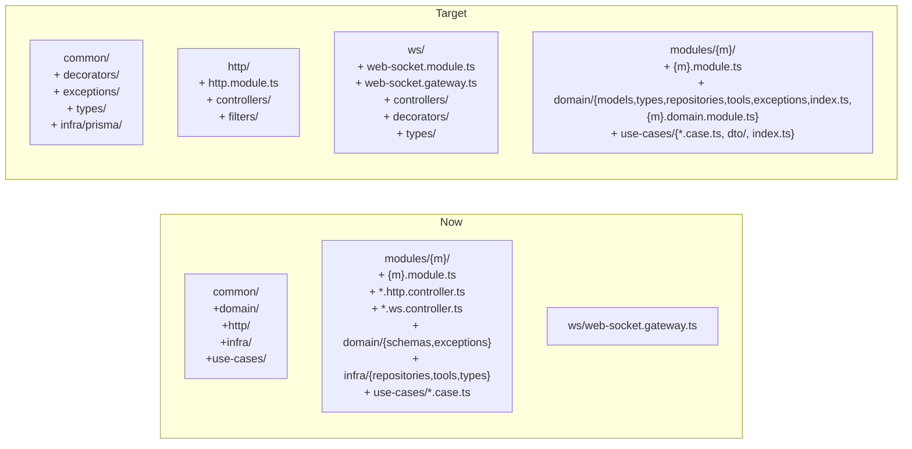

# Refactor under reference

Текущая структура vs целевая (после рефакторинга) — ключевое расхождение:



## Базовые соглашения (берутся из эталона + skill-файлов)

- `DomainException` базовый — объектная сигнатура: `super({ code, message, cause?, metadata? })`. `code` в `UPPER_SNAKE_CASE`, `message` на русском.
- `DtoFailed` — переименование текущего `DtoValidationFailed`.
- Use cases ОСТАЮТСЯ в текущем виде: файлы `*.case.ts`, классы с суффиксом `Case` (`SignUpCase`, `GetUserCase`, …). Это сознательное отклонение от эталона/skill `use-case-class` по требованию пользователя.
- `domain/` модуля содержит: `index.ts` (public API), `{m}.domain.module.ts` (Nest @Module), `models/` (interface, БЕЗ zod), при необходимости `types/`, `repositories/`, `tools/`, `gateways/`, `exceptions/`.
- Контроллеры HTTP — `src/http/controllers/{m}.controller.ts`. WS-обработчики — `@Injectable()` классы в `src/ws/controllers/{m}.ws.controller.ts`, инжектятся в единственный `WebSocketGateway`.
- Бизнес-модули НЕ импортируются в `app.module.ts` напрямую — собираются в `HttpModule` и `WebSocketModule`.

## Точки массового касания (для каждой замены — полный список)

Ниже зафиксированы файлы, в которых надо обновить импорты при выполнении соответствующих фаз. Это рабочий чек-лист — ничего другого трогать не надо.

### Замена `import { ValidateDto } from '@common/use-cases'` → `'@common/decorators'`

- [backend/src/modules/auth/use-cases/sign-up.case.ts](backend/src/modules/auth/use-cases/sign-up.case.ts)
- [backend/src/modules/auth/use-cases/sign-in.case.ts](backend/src/modules/auth/use-cases/sign-in.case.ts)
- [backend/src/modules/auth/use-cases/refresh-tokens.case.ts](backend/src/modules/auth/use-cases/refresh-tokens.case.ts)
- [backend/src/modules/auth/use-cases/logout.case.ts](backend/src/modules/auth/use-cases/logout.case.ts)
- [backend/src/modules/auth/use-cases/get-me.case.ts](backend/src/modules/auth/use-cases/get-me.case.ts)
- [backend/src/modules/user/use-cases/get-user.case.ts](backend/src/modules/user/use-cases/get-user.case.ts)
- [backend/src/modules/workspace/use-cases/get-member.case.ts](backend/src/modules/workspace/use-cases/get-member.case.ts)

### Замена `from '@common/domain'` (`DomainException`, `New`)

- `DomainException` → `'@common/exceptions'`:
  - [backend/src/modules/auth/domain/exceptions/email-already-exists.ts](backend/src/modules/auth/domain/exceptions/email-already-exists.ts)
  - [backend/src/modules/auth/domain/exceptions/invalid-credentials.ts](backend/src/modules/auth/domain/exceptions/invalid-credentials.ts)
  - [backend/src/modules/auth/domain/exceptions/unauthorized.ts](backend/src/modules/auth/domain/exceptions/unauthorized.ts)
  - [backend/src/modules/user/domain/exceptions/user-not-found.ts](backend/src/modules/user/domain/exceptions/user-not-found.ts)
- `New` → `'@common/types'`:
  - [backend/src/modules/auth/infra/repositories/user-credentials.repository.ts](backend/src/modules/auth/infra/repositories/user-credentials.repository.ts) (переезжает в `domain/repositories/`)
  - [backend/src/modules/user/infra/repositories/user.repository.ts](backend/src/modules/user/infra/repositories/user.repository.ts) (переезжает)
  - [backend/src/modules/workspace/infra/repositories/workspace.repository.ts](backend/src/modules/workspace/infra/repositories/workspace.repository.ts) (переезжает)
  - [backend/src/modules/workspace/infra/repositories/member.repository.ts](backend/src/modules/workspace/infra/repositories/member.repository.ts) (переезжает)

### Замена deep-import `'@common/infra/prisma/prisma-trx-runner'` → barrel `'@common/infra/prisma'`

- [backend/src/modules/auth/use-cases/sign-up.case.ts](backend/src/modules/auth/use-cases/sign-up.case.ts)
- [backend/src/common/infra/prisma/prisma.module.ts](backend/src/common/infra/prisma/prisma.module.ts) (внутри common/infra/prisma — ссылка по относительному пути; обновится при переименовании файла)
- [backend/src/common/infra/prisma/index.ts](backend/src/common/infra/prisma/index.ts) (то же самое)

### Замена `from '../infra/...'` или `from '@modules/{m}/infra/...'` → `'@modules/{m}/domain/...'`

После переезда `infra/{repositories,tools,types}` → `domain/{repositories,tools,types}` в фазах 5–7 ниже файлах надо обновить импорты:

- [backend/src/modules/auth/use-cases/sign-up.case.ts](backend/src/modules/auth/use-cases/sign-up.case.ts) — `PasswordHasher`, `TokenCodec`, `UserCredentialsRepository`, `UserRepository`, `WorkspaceRepository`, `MemberRepository`, `UserTokens`
- [backend/src/modules/auth/use-cases/sign-in.case.ts](backend/src/modules/auth/use-cases/sign-in.case.ts) — `PasswordHasher`, `TokenCodec`, `UserCredentialsRepository`, `UserRepository`, `UserTokens`
- [backend/src/modules/auth/use-cases/refresh-tokens.case.ts](backend/src/modules/auth/use-cases/refresh-tokens.case.ts) — `TokenCodec`, `UserCredentialsRepository`, `UserRepository`, `UserTokens`
- [backend/src/modules/auth/use-cases/logout.case.ts](backend/src/modules/auth/use-cases/logout.case.ts) — `UserCredentialsRepository`
- [backend/src/modules/auth/use-cases/get-me.case.ts](backend/src/modules/auth/use-cases/get-me.case.ts) — `TokenCodec`, `UserRepository`
- [backend/src/modules/user/use-cases/get-user.case.ts](backend/src/modules/user/use-cases/get-user.case.ts) — `UserRepository`
- [backend/src/modules/workspace/use-cases/get-member.case.ts](backend/src/modules/workspace/use-cases/get-member.case.ts) — `MemberRepository`
- [backend/src/modules/auth/auth.module.ts](backend/src/modules/auth/auth.module.ts) — `AuthInfraModule`/`UserInfraModule`/`WorkspaceInfraModule` → `AuthDomainModule`/`UserDomainModule`/`WorkspaceDomainModule`
- [backend/src/modules/user/user.module.ts](backend/src/modules/user/user.module.ts) — `UserInfraModule` → `UserDomainModule`
- [backend/src/modules/workspace/workspace.module.ts](backend/src/modules/workspace/workspace.module.ts) — `WorkspaceInfraModule` → `WorkspaceDomainModule`
- [backend/src/modules/auth/auth.http.controller.ts](backend/src/modules/auth/auth.http.controller.ts) — `UserTokens` (переезжает в `auth/domain/types/`)

### Замена `from '../../domain/schemas/...'` или `from '@modules/{m}/domain/schemas/...'` → `'@modules/{m}/domain/models/...'`

- [backend/src/modules/auth/use-cases/sign-up.case.ts](backend/src/modules/auth/use-cases/sign-up.case.ts) — `WorkspaceMemberRole`, `User`, `Workspace`
- [backend/src/modules/auth/use-cases/sign-in.case.ts](backend/src/modules/auth/use-cases/sign-in.case.ts) — `User`, `UserCredentials`
- [backend/src/modules/auth/use-cases/refresh-tokens.case.ts](backend/src/modules/auth/use-cases/refresh-tokens.case.ts) — `User`, `UserCredentials`
- [backend/src/modules/auth/use-cases/logout.case.ts](backend/src/modules/auth/use-cases/logout.case.ts) — `UserCredentials`
- [backend/src/modules/auth/use-cases/get-me.case.ts](backend/src/modules/auth/use-cases/get-me.case.ts) — `User`
- [backend/src/modules/user/use-cases/get-user.case.ts](backend/src/modules/user/use-cases/get-user.case.ts) — `User`
- [backend/src/modules/workspace/use-cases/get-member.case.ts](backend/src/modules/workspace/use-cases/get-member.case.ts) — `WorkspaceMember`
- [backend/src/modules/auth/auth.http.controller.ts](backend/src/modules/auth/auth.http.controller.ts) — `User`
- [backend/src/modules/user/user.ws.controller.ts](backend/src/modules/user/user.ws.controller.ts) — `User`
- [backend/src/ws/web-socket.gateway.ts](backend/src/ws/web-socket.gateway.ts) — `User`, `WorkspaceMember`
- [backend/src/ws/types/index.ts](backend/src/ws/types/index.ts) — `User`, `WorkspaceMember`
- [backend/src/ws/decorators/connected-member.ts](backend/src/ws/decorators/connected-member.ts) — `WorkspaceMember`
- Все 4 репозитория (см. блок выше) — внутренние ссылки `'../../domain/schemas/...'` → `'../models/...'`

### Замена `from './common/http/filters'` / `'@common/http/...'` → `'@http/filters'`

- [backend/src/main.ts](backend/src/main.ts) (импорт `DomainExceptionFilter`, `DtoValidationFailedFilter`)
- [backend/src/modules/auth/auth.module.ts](backend/src/modules/auth/auth.module.ts) (импорт `DomainExceptionFilter` для `register(...)`)

### Переименование классов

- `DtoValidationFailed` → `DtoFailed` (объявление + 2 импорта):
  - [backend/src/common/use-cases/dto-validation-failed.exception.ts](backend/src/common/use-cases/dto-validation-failed.exception.ts) (переезд в `common/exceptions/`)
  - [backend/src/common/use-cases/validate-dto.decorator.ts](backend/src/common/use-cases/validate-dto.decorator.ts) (переезд в `common/decorators/`)
  - [backend/src/common/http/filters/dto-validation-failed.filter.ts](backend/src/common/http/filters/dto-validation-failed.filter.ts) (переезд в `src/http/filters/`)
- `AuthHttpController` → `AuthController`:
  - [backend/src/modules/auth/auth.http.controller.ts](backend/src/modules/auth/auth.http.controller.ts) (переезд в `src/http/controllers/auth.controller.ts`)

---

## Ключевые файлы и переезды

### common/ — новая раскладка

- `[backend/src/common/exceptions/domain.exception.ts](backend/src/common/exceptions/domain.exception.ts)` — новый, заменяет [backend/src/common/domain/exceptions/domain.exception.ts](backend/src/common/domain/exceptions/domain.exception.ts). Сигнатура:

```ts
export abstract class DomainException extends Error {
  constructor(params: { code: string; message: string; cause?: Error; metadata?: Record<string, unknown> }) {
    super(params.message, params.cause ? { cause: params.cause } : undefined)
    this.name = new.target.name
    this.code = params.code
    this.metadata = params.metadata
    Error.captureStackTrace?.(this, new.target)
  }
  public readonly code: string
  public readonly metadata?: Record<string, unknown>
}
```

- `[backend/src/common/exceptions/dto-failed.exception.ts](backend/src/common/exceptions/dto-failed.exception.ts)` — перенос+переименование класса `DtoValidationFailed` → `DtoFailed` из [backend/src/common/use-cases/dto-validation-failed.exception.ts](backend/src/common/use-cases/dto-validation-failed.exception.ts).
- `[backend/src/common/exceptions/index.ts](backend/src/common/exceptions/index.ts)` — barrel: `DomainException`, `DtoFailed`.
- `[backend/src/common/decorators/validate-dto.decorator.ts](backend/src/common/decorators/validate-dto.decorator.ts)` — перенос из [backend/src/common/use-cases/validate-dto.decorator.ts](backend/src/common/use-cases/validate-dto.decorator.ts), импорт `DtoFailed` из `@common/exceptions`.
- `[backend/src/common/decorators/index.ts](backend/src/common/decorators/index.ts)` — barrel: `ValidateDto`.
- `[backend/src/common/types/generics.ts](backend/src/common/types/generics.ts)` — расширить под эталон:

```ts
export type SystemFields = { id: string; createdAt: Date; updatedAt: Date }
export type New<T> = Omit<Required<T>, keyof SystemFields>
export type Updatable<T> = Partial<New<T>>
```

  Внимание: в эталоне `id: number`, у нас `id: string` (UUID). Это сознательное отличие.
- `[backend/src/common/types/index.ts](backend/src/common/types/index.ts)` — barrel: `SystemFields`, `New`, `Updatable`.
- Удалить: [backend/src/common/domain/](backend/src/common/domain), [backend/src/common/use-cases/](backend/src/common/use-cases), [backend/src/common/http/](backend/src/common/http) (после переноса фильтров в фазу 5).
- Переименовать `[backend/src/common/infra/prisma/prisma-trx-runner.ts](backend/src/common/infra/prisma/prisma-trx-runner.ts)` → `transaction.runner.ts` (для соответствия эталонному стилю), barrel-экспорт уже есть.

### tsconfig + jest paths

- `[backend/tsconfig.json](backend/tsconfig.json)` — добавить `@http/*` → `src/http/*`, `@ws/*` → `src/ws/*`.
- `[backend/package.json](backend/package.json)` — `jest.moduleNameMapper`: добавить `^@http/(.*)$` и `^@ws/(.*)$`.

### modules/ — переезд infra → domain, schemas → models, exceptions

Для каждого из `auth`, `user`, `workspace`:

- Создать `domain/{m}.domain.module.ts` — Nest `@Module`, регистрирует/экспортирует все `@Injectable` из `domain/repositories`, `domain/tools`, `domain/gateways`.
- Создать `domain/index.ts` — public API: типы моделей, типы из `domain/types/`, exception-классы. `*.domain.module.ts` НЕ экспортируется.
- `domain/schemas/{file}.ts` (zod) → `domain/models/{file}.ts` (TypeScript `interface`). Удалить zod-схемы и парсинг.
- `infra/repositories/*` → `domain/repositories/*`. В реализации репозитория убрать `parse(Schema, row)`, полагаемся на типизацию Prisma.
- `infra/tools/*` (только `auth`) → `domain/tools/*`.
- `infra/types/index.ts` (только `auth`) → `domain/types/index.ts`.
- Удалить `modules/{m}/infra/`, включая `*.infra.module.ts`.
- Переписать каждый `domain/exceptions/*.ts` под новую сигнатуру `DomainException`:
  - `EmailAlreadyExists` → `code: 'EMAIL_ALREADY_EXISTS'`, `metadata: { email }`.
  - `InvalidCredentials` → `code: 'INVALID_CREDENTIALS'`.
  - `Unauthorized` → `code: 'UNAUTHORIZED'`.
  - `UserNotFound` → `code: 'USER_NOT_FOUND'`, `metadata: { userId }` (use case передаёт id явно).

Конкретные файлы:

- [backend/src/modules/auth/domain/exceptions/email-already-exists.ts](backend/src/modules/auth/domain/exceptions/email-already-exists.ts), [invalid-credentials.ts](backend/src/modules/auth/domain/exceptions/invalid-credentials.ts), [unauthorized.ts](backend/src/modules/auth/domain/exceptions/unauthorized.ts)
- [backend/src/modules/user/domain/exceptions/user-not-found.ts](backend/src/modules/user/domain/exceptions/user-not-found.ts) (передавать `userId` параметром)
- Переезд репозиториев: [backend/src/modules/auth/infra/repositories/user-credentials.repository.ts](backend/src/modules/auth/infra/repositories/user-credentials.repository.ts), [backend/src/modules/user/infra/repositories/user.repository.ts](backend/src/modules/user/infra/repositories/user.repository.ts), [backend/src/modules/workspace/infra/repositories/workspace.repository.ts](backend/src/modules/workspace/infra/repositories/workspace.repository.ts), [backend/src/modules/workspace/infra/repositories/member.repository.ts](backend/src/modules/workspace/infra/repositories/member.repository.ts)
- Переезд tools: [backend/src/modules/auth/infra/tools/password-hasher.ts](backend/src/modules/auth/infra/tools/password-hasher.ts), [backend/src/modules/auth/infra/tools/token-codec.ts](backend/src/modules/auth/infra/tools/token-codec.ts)
- Переезд types: [backend/src/modules/auth/infra/types/index.ts](backend/src/modules/auth/infra/types/index.ts) (`UserTokens`, `AccessTokenPayload`)

### Use cases — имена остаются, но импорты обновляются

Файлы `*.case.ts` и классы с суффиксом `Case` сохраняются. Меняем только импорты:

- `ValidateDto` → импорт из `@common/decorators` (вместо `@common/use-cases`).
- `New`, `DomainException` → импорт из `@common/types`, `@common/exceptions` (вместо `@common/domain`).
- Репозитории, tools, типы домена — импорт из `domain/`-путей (после переезда `infra/ → domain/` в фазе 3); возможен короткий путь через barrel `@modules/{m}/domain`.
- `TransactionRunner`, `PrismaService` — импорт через barrel `@common/infra/prisma`.

Затронутые файлы (имена классов и расширения сохраняются):

- [backend/src/modules/auth/use-cases/sign-up.case.ts](backend/src/modules/auth/use-cases/sign-up.case.ts) (`SignUpCase`)
- [backend/src/modules/auth/use-cases/sign-in.case.ts](backend/src/modules/auth/use-cases/sign-in.case.ts) (`SignInCase`)
- [backend/src/modules/auth/use-cases/refresh-tokens.case.ts](backend/src/modules/auth/use-cases/refresh-tokens.case.ts) (`RefreshTokensCase`)
- [backend/src/modules/auth/use-cases/logout.case.ts](backend/src/modules/auth/use-cases/logout.case.ts) (`LogoutCase`)
- [backend/src/modules/auth/use-cases/get-me.case.ts](backend/src/modules/auth/use-cases/get-me.case.ts) (`GetMeCase`)
- [backend/src/modules/user/use-cases/get-user.case.ts](backend/src/modules/user/use-cases/get-user.case.ts) (`GetUserCase`)
- [backend/src/modules/workspace/use-cases/get-member.case.ts](backend/src/modules/workspace/use-cases/get-member.case.ts) (`GetMemberCase`)

Барелы `use-cases/index.ts` всех трёх модулей не меняются по экспортируемым именам (только импорты внутри файлов use cases затрагиваются).

### src/http/ — top-level транспорт

- `[backend/src/http/http.module.ts](backend/src/http/http.module.ts)` — новый. `imports: [AuthModule, UserModule, WorkspaceModule]`, `controllers: [AuthController]`.
- Перенести [backend/src/modules/auth/auth.http.controller.ts](backend/src/modules/auth/auth.http.controller.ts) → `[backend/src/http/controllers/auth.controller.ts](backend/src/http/controllers/auth.controller.ts)`. Класс `AuthHttpController` → `AuthController`. Импорты use cases — через barrel `@modules/auth/use-cases` (имена `SignUpCase`, `SignInCase`, `RefreshTokensCase`, `LogoutCase`, `GetMeCase` остаются).
- Перенести фильтры [backend/src/common/http/filters/domain-exception.filter.ts](backend/src/common/http/filters/domain-exception.filter.ts) и [backend/src/common/http/filters/dto-validation-failed.filter.ts](backend/src/common/http/filters/dto-validation-failed.filter.ts) → `src/http/filters/`. Поправить импорты: `DomainException` и `DtoFailed` из `@common/exceptions`.
- `[backend/src/http/filters/index.ts](backend/src/http/filters/index.ts)` — barrel.
- В [backend/src/main.ts](backend/src/main.ts) — импорт фильтров через `@http/filters`.

### src/ws/ — controllers + один gateway

- Перенести [backend/src/modules/user/user.ws.controller.ts](backend/src/modules/user/user.ws.controller.ts) → `[backend/src/ws/controllers/user.ws.controller.ts](backend/src/ws/controllers/user.ws.controller.ts)`. Импорт `GetUserCase` — через barrel `@modules/user/use-cases` (имя класса не меняется).
- `[backend/src/ws/controllers/index.ts](backend/src/ws/controllers/index.ts)` — barrel.
- В [backend/src/ws/web-socket.gateway.ts](backend/src/ws/web-socket.gateway.ts) — инжектить `UserWsController` (и будущих), `@SubscribeMessage('user:me')` дёргает `this.userWsController.me(...)`.
- В [backend/src/ws/web-socket.module.ts](backend/src/ws/web-socket.module.ts) — `imports: [AuthModule, UserModule, WorkspaceModule]`, `providers: [WebSocketGateway, UserWsController]`.

### Корневые модули и app

- [backend/src/modules/auth/auth.module.ts](backend/src/modules/auth/auth.module.ts):
  - убрать `controllers: [AuthHttpController]`;
  - `imports`: `[AuthDomainModule, UserDomainModule, WorkspaceDomainModule]` вместо `*.infra.module.ts`;
  - `providers/exports` остаются: `[SignUpCase, SignInCase, RefreshTokensCase, LogoutCase, GetMeCase]`;
  - оставить регистрации `DomainExceptionFilter.register(...)` как есть.
- [backend/src/modules/user/user.module.ts](backend/src/modules/user/user.module.ts):
  - убрать `UserWsController` из providers/exports (он теперь в `WebSocketModule`);
  - `imports: [UserDomainModule]`, `providers/exports: [GetUserCase]`.
- [backend/src/modules/workspace/workspace.module.ts](backend/src/modules/workspace/workspace.module.ts):
  - `imports: [WorkspaceDomainModule]`, `providers/exports: [GetMemberCase]`.
- [backend/src/app.module.ts](backend/src/app.module.ts):

```ts
@Module({
  imports: [
    ConfigModule.forRoot({ isGlobal: true }),
    ClsModule.forRoot({ global: true, middleware: { mount: true } }),
    PrismaModule,
    HttpModule,
    WebSocketModule
  ]
})
export class AppModule {}
```

  Бизнес-модули из `app.module.ts` удаляются (подтянутся транзитивно через `HttpModule` и `WebSocketModule`).

---

## Пофайловые шаги по фазам

Здесь — для каждого нового или меняемого файла итоговое содержимое (или точные изменения). Это позволяет выполнять шаги без догадок.

### Phase 0 — tsconfig + jest paths

**[backend/tsconfig.json](backend/tsconfig.json)** — в `compilerOptions.paths` добавить два маппинга:

```json
"paths": {
  "@modules/*": ["src/modules/*"],
  "@common/*":  ["src/common/*"],
  "@http/*":    ["src/http/*"],
  "@ws/*":      ["src/ws/*"]
}
```

**[backend/package.json](backend/package.json)** — в `jest.moduleNameMapper` добавить два правила:

```json
"moduleNameMapper": {
  "^@modules/(.*)$": "<rootDir>/modules/$1",
  "^@common/(.*)$":  "<rootDir>/common/$1",
  "^@http/(.*)$":    "<rootDir>/http/$1",
  "^@ws/(.*)$":      "<rootDir>/ws/$1"
}
```

### Phase 1 — common/exceptions

Создать три файла.

`backend/src/common/exceptions/domain.exception.ts`:

```ts
export abstract class DomainException extends Error {
  constructor(params: DomainExceptionParams) {
    super(params.message, params.cause ? { cause: params.cause } : undefined)

    this.name = new.target.name
    this.code = params.code
    this.metadata = params.metadata
    Error.captureStackTrace?.(this, new.target)
  }

  public readonly code: string
  public readonly metadata?: Record<string, unknown>
}

type DomainExceptionParams = {
  code: string
  message: string
  cause?: Error
  metadata?: Record<string, unknown>
}
```

`backend/src/common/exceptions/dto-failed.exception.ts` (контент перенесён из [backend/src/common/use-cases/dto-validation-failed.exception.ts](backend/src/common/use-cases/dto-validation-failed.exception.ts), класс переименован в `DtoFailed`):

```ts
export class DtoFailed extends Error {
  public readonly errors: Record<string, string[]>

  constructor(errors: Record<string, string[]>) {
    super('Валидация UseCase DTO не прошла')
    this.errors = errors
    Object.setPrototypeOf(this, new.target.prototype)
  }
}
```

`backend/src/common/exceptions/index.ts`:

```ts
export { DomainException } from './domain.exception'
export { DtoFailed } from './dto-failed.exception'
```

### Phase 2 — common/decorators

`backend/src/common/decorators/validate-dto.decorator.ts` — копия [backend/src/common/use-cases/validate-dto.decorator.ts](backend/src/common/use-cases/validate-dto.decorator.ts) с одним отличием: импорт исключения теперь:

```ts
import { DtoFailed } from '@common/exceptions'
```

вместо `import { DtoValidationFailed } from './dto-validation-failed.exception'`. Все упоминания `DtoValidationFailed` в теле файла заменить на `DtoFailed`.

`backend/src/common/decorators/index.ts`:

```ts
export { ValidateDto } from './validate-dto.decorator'
```

### Phase 3 — common/types

`backend/src/common/types/generics.ts`:

```ts
export type SystemFields = { id: string; createdAt: Date; updatedAt: Date }

export type New<T> = Omit<Required<T>, keyof SystemFields>

export type Updatable<T> = Partial<New<T>>
```

`backend/src/common/types/index.ts`:

```ts
export type { SystemFields, New, Updatable } from './generics'
```

### Phase 4 — common/infra/prisma

Переименовать файл [backend/src/common/infra/prisma/prisma-trx-runner.ts](backend/src/common/infra/prisma/prisma-trx-runner.ts) → `backend/src/common/infra/prisma/transaction.runner.ts`. Содержимое не меняется.

[backend/src/common/infra/prisma/index.ts](backend/src/common/infra/prisma/index.ts) — поправить путь:

```ts
export { PrismaModule } from './prisma.module'
export { PrismaConnector } from './prisma.connector'
export { PrismaService } from './prisma.service'
export { TransactionContext } from './transaction-context'
export { TransactionRunner } from './transaction.runner'
```

[backend/src/common/infra/prisma/prisma.module.ts](backend/src/common/infra/prisma/prisma.module.ts) — внутри файла одна ссылка на относительный путь — поправить на `'./transaction.runner'`.

### Phase 5 — modules/auth/domain (полностью новая раскладка)

#### 5.1 models/

`backend/src/modules/auth/domain/models/user-credentials.ts` (заменяет zod-схему чистым interface):

```ts
import type { RefreshToken } from './refresh-token'

export interface UserCredentials {
  id: string
  userId: string
  passwordHash: string
  refreshTokens: RefreshToken[]
}
```

`backend/src/modules/auth/domain/models/refresh-token.ts`:

```ts
export interface RefreshToken {
  value: string
  expiresAt: Date
  createdAt: Date
}
```

#### 5.2 types/

`backend/src/modules/auth/domain/types/index.ts` (контент из [backend/src/modules/auth/infra/types/index.ts](backend/src/modules/auth/infra/types/index.ts)):

```ts
export interface UserTokens {
  accessToken: string
  refreshToken: string
}

export interface AccessTokenPayload {
  userId: string
  email: string
}
```

#### 5.3 exceptions/ — новая сигнатура

`backend/src/modules/auth/domain/exceptions/email-already-exists.ts`:

```ts
import { DomainException } from '@common/exceptions'

export class EmailAlreadyExists extends DomainException {
  constructor(email: string) {
    super({
      code: 'EMAIL_ALREADY_EXISTS',
      message: `Пользователь с email ${email} уже зарегистрирован`,
      metadata: { email }
    })
  }
}
```

`backend/src/modules/auth/domain/exceptions/invalid-credentials.ts`:

```ts
import { DomainException } from '@common/exceptions'

export class InvalidCredentials extends DomainException {
  constructor() {
    super({
      code: 'INVALID_CREDENTIALS',
      message: 'Неверный email или пароль'
    })
  }
}
```

`backend/src/modules/auth/domain/exceptions/unauthorized.ts`:

```ts
import { DomainException } from '@common/exceptions'

export class Unauthorized extends DomainException {
  constructor() {
    super({
      code: 'UNAUTHORIZED',
      message: 'Не авторизован'
    })
  }
}
```

#### 5.4 tools/ — переезд из infra/tools/

[backend/src/modules/auth/infra/tools/password-hasher.ts](backend/src/modules/auth/infra/tools/password-hasher.ts) → `backend/src/modules/auth/domain/tools/password-hasher.ts`. Содержимое не меняется.

[backend/src/modules/auth/infra/tools/token-codec.ts](backend/src/modules/auth/infra/tools/token-codec.ts) → `backend/src/modules/auth/domain/tools/token-codec.ts`. Внутри обновить два импорта:
- `'../../domain/exceptions/unauthorized'` → `'../exceptions/unauthorized'`
- `'../types'` → `'../types'` (внутри домена остаётся как есть — но проверить, что путь актуален после переезда)
- `'../../domain/schemas/refresh-token'` → `'../models/refresh-token'`

#### 5.5 repositories/ — переезд + удаление zod parse()

`backend/src/modules/auth/domain/repositories/user-credentials.repository.ts`:

```ts
import { Injectable } from '@nestjs/common'
import { PrismaService } from '@common/infra/prisma'
import type { New } from '@common/types'
import type { UserCredentials } from '../models/user-credentials'

@Injectable()
export class UserCredentialsRepository {
  constructor(private readonly prisma: PrismaService) {}

  async findByUserId(userId: string): Promise<UserCredentials | null> {
    return this.prisma.db.userCredentials.findFirst({
      where: { userId },
      include: { refreshTokens: true }
    })
  }

  async findByRefreshToken(value: string): Promise<UserCredentials | null> {
    const token = await this.prisma.db.refreshToken.findUnique({
      where: { value },
      select: { userCredsId: true }
    })
    if (!token) return null

    return this.prisma.db.userCredentials.findUnique({
      where: { id: token.userCredsId },
      include: { refreshTokens: true }
    })
  }

  async create(data: New<UserCredentials>): Promise<UserCredentials> {
    const { userId, passwordHash, refreshTokens } = data

    return this.prisma.db.userCredentials.create({
      data: {
        userId,
        passwordHash,
        ...(refreshTokens.length ? { refreshTokens: { create: refreshTokens } } : {})
      },
      include: { refreshTokens: true }
    })
  }

  async update(userCreds: UserCredentials): Promise<UserCredentials> {
    const { id, passwordHash, refreshTokens } = userCreds

    return this.prisma.db.userCredentials.update({
      where: { id },
      data: {
        passwordHash,
        refreshTokens: {
          deleteMany: {},
          ...(refreshTokens.length ? { create: refreshTokens } : {})
        }
      },
      include: { refreshTokens: true }
    })
  }

  async deleteByUserId(userId: string): Promise<void> {
    await this.prisma.db.userCredentials.deleteMany({
      where: { userId }
    })
  }
}
```

ВАЖНО: тип возврата Prisma `findFirst({ include: { refreshTokens: true } })` — это `UserCredentials & { refreshTokens: RefreshToken[] }` из `@prisma/client`. Поля совпадут с нашим `interface UserCredentials`, но Prisma включает поле `refreshTokens[].id` и `refreshTokens[].userCredsId`, которых нет в нашем `interface RefreshToken`. См. блок «Риски» — нужно либо добавить эти поля в interface, либо сделать минимальный `toDomain` маппер.

#### 5.6 auth.domain.module.ts

`backend/src/modules/auth/domain/auth.domain.module.ts`:

```ts
import { Module } from '@nestjs/common'
import { ConfigService } from '@nestjs/config'
import { JwtModule } from '@nestjs/jwt'
import { UserCredentialsRepository } from './repositories/user-credentials.repository'
import { PasswordHasher } from './tools/password-hasher'
import { TokenCodec } from './tools/token-codec'
import type { SignOptions } from 'jsonwebtoken'

@Module({
  imports: [
    JwtModule.registerAsync({
      inject: [ConfigService],
      useFactory: (config: ConfigService) => ({
        secret: config.getOrThrow<string>('ACCESS_TOKEN_SECRET'),
        signOptions: {
          expiresIn: config.getOrThrow<string>(
            'ACCESS_TOKEN_EXPIRES_IN'
          ) as SignOptions['expiresIn']
        }
      })
    })
  ],
  providers: [UserCredentialsRepository, PasswordHasher, TokenCodec],
  exports: [UserCredentialsRepository, PasswordHasher, TokenCodec]
})
export class AuthDomainModule {}
```

#### 5.7 domain/index.ts (public API)

`backend/src/modules/auth/domain/index.ts`:

```ts
export type { UserCredentials } from './models/user-credentials'
export type { RefreshToken } from './models/refresh-token'
export type { UserTokens, AccessTokenPayload } from './types'

export { EmailAlreadyExists } from './exceptions/email-already-exists'
export { InvalidCredentials } from './exceptions/invalid-credentials'
export { Unauthorized } from './exceptions/unauthorized'
```

#### 5.8 удалить старые файлы

- [backend/src/modules/auth/infra/auth.infra.module.ts](backend/src/modules/auth/infra/auth.infra.module.ts)
- [backend/src/modules/auth/infra/repositories/user-credentials.repository.ts](backend/src/modules/auth/infra/repositories/user-credentials.repository.ts)
- [backend/src/modules/auth/infra/tools/password-hasher.ts](backend/src/modules/auth/infra/tools/password-hasher.ts)
- [backend/src/modules/auth/infra/tools/token-codec.ts](backend/src/modules/auth/infra/tools/token-codec.ts)
- [backend/src/modules/auth/infra/types/index.ts](backend/src/modules/auth/infra/types/index.ts)
- [backend/src/modules/auth/domain/schemas/user-credentials.ts](backend/src/modules/auth/domain/schemas/user-credentials.ts)
- [backend/src/modules/auth/domain/schemas/refresh-token.ts](backend/src/modules/auth/domain/schemas/refresh-token.ts)
- Папки `modules/auth/infra/` и `modules/auth/domain/schemas/` (после удаления файлов)

### Phase 6 — modules/user/domain

#### 6.1 models/

`backend/src/modules/user/domain/models/user.ts`:

```ts
export interface User {
  id: string
  firstName: string
  lastName: string
  email: string
  avatarUrl: string | null
  lastWorkspaceId: string | null
  createdAt: Date
  updatedAt: Date
}
```

#### 6.2 exceptions/ — новая сигнатура

`backend/src/modules/user/domain/exceptions/user-not-found.ts`:

```ts
import { DomainException } from '@common/exceptions'

export class UserNotFound extends DomainException {
  constructor(userId: string) {
    super({
      code: 'USER_NOT_FOUND',
      message: `Пользователь с id=${userId} не найден`,
      metadata: { userId }
    })
  }
}
```

В [backend/src/modules/user/use-cases/get-user.case.ts](backend/src/modules/user/use-cases/get-user.case.ts) `private throwUserNotFound()` теперь принимает `userId: string`:

```ts
private throwUserNotFound(userId: string): never {
  throw new UserNotFound(userId)
}
```

И вызов: `return user ?? this.throwUserNotFound(dto.userId)`.

#### 6.3 repositories/ — переезд

`backend/src/modules/user/domain/repositories/user.repository.ts` — содержимое из [backend/src/modules/user/infra/repositories/user.repository.ts](backend/src/modules/user/infra/repositories/user.repository.ts), но импорты:

```ts
import { Injectable } from '@nestjs/common'
import { PrismaService } from '@common/infra/prisma'
import type { New } from '@common/types'
import type { User } from '../models/user'
```

#### 6.4 user.domain.module.ts

`backend/src/modules/user/domain/user.domain.module.ts`:

```ts
import { Module } from '@nestjs/common'
import { UserRepository } from './repositories/user.repository'

@Module({
  providers: [UserRepository],
  exports: [UserRepository]
})
export class UserDomainModule {}
```

#### 6.5 domain/index.ts

`backend/src/modules/user/domain/index.ts`:

```ts
export type { User } from './models/user'
export { UserNotFound } from './exceptions/user-not-found'
```

#### 6.6 удалить старые файлы

- [backend/src/modules/user/infra/user.infra.module.ts](backend/src/modules/user/infra/user.infra.module.ts)
- [backend/src/modules/user/infra/repositories/user.repository.ts](backend/src/modules/user/infra/repositories/user.repository.ts)
- [backend/src/modules/user/domain/schemas/user.ts](backend/src/modules/user/domain/schemas/user.ts)
- Папки `modules/user/infra/` и `modules/user/domain/schemas/`

### Phase 7 — modules/workspace/domain

#### 7.1 models/

`backend/src/modules/workspace/domain/models/workspace.ts`:

```ts
export interface Workspace {
  id: string
  name: string
  creatorId: string
  createdAt: Date
  updatedAt: Date
}
```

`backend/src/modules/workspace/domain/models/workspace-member.ts`:

```ts
export const WorkspaceMemberRole = {
  owner: 'owner',
  admin: 'admin',
  member: 'member'
} as const
export type WorkspaceMemberRole = (typeof WorkspaceMemberRole)[keyof typeof WorkspaceMemberRole]

export interface WorkspaceMember {
  workspaceId: string
  userId: string
  role: WorkspaceMemberRole
  joinedAt: Date
}
```

#### 7.2 repositories/ — переезд

Перенести [backend/src/modules/workspace/infra/repositories/workspace.repository.ts](backend/src/modules/workspace/infra/repositories/workspace.repository.ts) → `backend/src/modules/workspace/domain/repositories/workspace.repository.ts`. Импорты:

```ts
import { Injectable } from '@nestjs/common'
import { PrismaService } from '@common/infra/prisma'
import type { New } from '@common/types'
import type { Workspace } from '../models/workspace'
```

Аналогично для [backend/src/modules/workspace/infra/repositories/member.repository.ts](backend/src/modules/workspace/infra/repositories/member.repository.ts) → `backend/src/modules/workspace/domain/repositories/member.repository.ts`. Импорт `WorkspaceMember` — из `'../models/workspace-member'`.

#### 7.3 workspace.domain.module.ts

`backend/src/modules/workspace/domain/workspace.domain.module.ts`:

```ts
import { Module } from '@nestjs/common'
import { WorkspaceRepository } from './repositories/workspace.repository'
import { MemberRepository } from './repositories/member.repository'

@Module({
  providers: [WorkspaceRepository, MemberRepository],
  exports: [WorkspaceRepository, MemberRepository]
})
export class WorkspaceDomainModule {}
```

#### 7.4 domain/index.ts

`backend/src/modules/workspace/domain/index.ts`:

```ts
export type { Workspace } from './models/workspace'
export type { WorkspaceMember } from './models/workspace-member'
export { WorkspaceMemberRole } from './models/workspace-member'
```

#### 7.5 удалить старые файлы

- [backend/src/modules/workspace/infra/workspace.infra.module.ts](backend/src/modules/workspace/infra/workspace.infra.module.ts)
- [backend/src/modules/workspace/infra/repositories/workspace.repository.ts](backend/src/modules/workspace/infra/repositories/workspace.repository.ts)
- [backend/src/modules/workspace/infra/repositories/member.repository.ts](backend/src/modules/workspace/infra/repositories/member.repository.ts)
- [backend/src/modules/workspace/domain/schemas/workspace.ts](backend/src/modules/workspace/domain/schemas/workspace.ts)
- [backend/src/modules/workspace/domain/schemas/workspace-member.ts](backend/src/modules/workspace/domain/schemas/workspace-member.ts)
- Папки `modules/workspace/infra/` и `modules/workspace/domain/schemas/`

### Phase 8 — Use cases (имена *Case остаются, обновляем только импорты)

В каждом из 7 use case файлов поправить шапку. Тело и `class XxxCase` не трогать.

Шаблон правок:

```ts
// было
import { ValidateDto } from '@common/use-cases'
import { TransactionRunner } from '@common/infra/prisma/prisma-trx-runner'
import { PasswordHasher } from '../infra/tools/password-hasher'
import { UserRepository } from '@modules/user/infra/repositories/user.repository'
import { WorkspaceMemberRole } from '@modules/workspace/domain/schemas/workspace-member'
import type { User } from '@modules/user/domain/schemas/user'

// стало
import { ValidateDto } from '@common/decorators'
import { TransactionRunner } from '@common/infra/prisma'
import { PasswordHasher } from '../domain/tools/password-hasher'
import { UserRepository } from '@modules/user/domain/repositories/user.repository'
import { WorkspaceMemberRole } from '@modules/workspace/domain'
import type { User } from '@modules/user/domain'
```

Фактические правки по файлам (по списку «Точки массового касания» выше). Дополнительно:

- В [backend/src/modules/user/use-cases/get-user.case.ts](backend/src/modules/user/use-cases/get-user.case.ts) сигнатура `throwUserNotFound(userId: string)` — см. п. 6.2.

### Phase 9 — корневые модули

`backend/src/modules/auth/auth.module.ts`:

```ts
import { HttpStatus, Module } from '@nestjs/common'
import { DomainExceptionFilter } from '@http/filters'
import { UserDomainModule } from '@modules/user/domain/user.domain.module'
import { WorkspaceDomainModule } from '@modules/workspace/domain/workspace.domain.module'
import { AuthDomainModule } from './domain/auth.domain.module'
import { EmailAlreadyExists, InvalidCredentials, Unauthorized } from './domain'
import { GetMeCase } from './use-cases/get-me.case'
import { LogoutCase } from './use-cases/logout.case'
import { RefreshTokensCase } from './use-cases/refresh-tokens.case'
import { SignInCase } from './use-cases/sign-in.case'
import { SignUpCase } from './use-cases/sign-up.case'

DomainExceptionFilter.register(EmailAlreadyExists, HttpStatus.CONFLICT)
DomainExceptionFilter.register(InvalidCredentials, HttpStatus.UNAUTHORIZED)
DomainExceptionFilter.register(Unauthorized, HttpStatus.UNAUTHORIZED)

const useCases = [SignUpCase, SignInCase, RefreshTokensCase, LogoutCase, GetMeCase]

@Module({
  imports: [AuthDomainModule, UserDomainModule, WorkspaceDomainModule],
  providers: useCases,
  exports: [...useCases, AuthDomainModule]
})
export class AuthModule {}
```

Заметка: `controllers: [AuthHttpController]` убираем — HTTP-контроллер живёт в `HttpModule` (фаза 10). `AuthInfraModule`/`UserInfraModule`/`WorkspaceInfraModule` заменяем на `*.domain.module.ts`. `Unauthorized` теперь надо экспортировать из `domain/index.ts` (уже сделано в фазе 5.7).

`backend/src/modules/user/user.module.ts`:

```ts
import { Module } from '@nestjs/common'
import { UserDomainModule } from './domain/user.domain.module'
import { GetUserCase } from './use-cases'

@Module({
  imports: [UserDomainModule],
  providers: [GetUserCase],
  exports: [GetUserCase, UserDomainModule]
})
export class UserModule {}
```

`UserWsController` отсюда убран (он переедет в `WebSocketModule` в фазе 11).

`backend/src/modules/workspace/workspace.module.ts`:

```ts
import { Module } from '@nestjs/common'
import { WorkspaceDomainModule } from './domain/workspace.domain.module'
import { GetMemberCase } from './use-cases'

@Module({
  imports: [WorkspaceDomainModule],
  providers: [GetMemberCase],
  exports: [GetMemberCase, WorkspaceDomainModule]
})
export class WorkspaceModule {}
```

### Phase 10 — src/http/

#### 10.1 фильтры

Перенести [backend/src/common/http/filters/domain-exception.filter.ts](backend/src/common/http/filters/domain-exception.filter.ts) → `backend/src/http/filters/domain-exception.filter.ts`. Поправить импорт: `import { DomainException } from '@common/exceptions'` (убрать относительный путь). Дополнительно — в JSON-ответ добавить `code`:

```ts
response.status(status).json({
  statusCode: status,
  code: exception.code,
  message: exception.message
})
```

Перенести [backend/src/common/http/filters/dto-validation-failed.filter.ts](backend/src/common/http/filters/dto-validation-failed.filter.ts) → `backend/src/http/filters/dto-validation-failed.filter.ts`. Импорт: `import { DtoFailed } from '@common/exceptions'`. Заменить все `DtoValidationFailed` в типах и `@Catch(...)` на `DtoFailed`.

`backend/src/http/filters/index.ts`:

```ts
export { DomainExceptionFilter } from './domain-exception.filter'
export { DtoValidationFailedFilter } from './dto-validation-failed.filter'
```

#### 10.2 controllers

`backend/src/http/controllers/auth.controller.ts` — содержимое [backend/src/modules/auth/auth.http.controller.ts](backend/src/modules/auth/auth.http.controller.ts) с правками:
- класс переименовать `AuthHttpController` → `AuthController`;
- импорты use cases — относительные `'./use-cases/...'` заменить на `@modules/auth/use-cases/{file}` (имена `*Case` остаются);
- импорт `User` — `'@modules/user/domain'`;
- импорт `UserTokens` — `'@modules/auth/domain'`.

#### 10.3 http.module.ts

`backend/src/http/http.module.ts`:

```ts
import { Module } from '@nestjs/common'
import { AuthModule } from '@modules/auth/auth.module'
import { UserModule } from '@modules/user/user.module'
import { WorkspaceModule } from '@modules/workspace/workspace.module'
import { AuthController } from './controllers/auth.controller'

@Module({
  imports: [AuthModule, UserModule, WorkspaceModule],
  controllers: [AuthController]
})
export class HttpModule {}
```

#### 10.4 удалить старые файлы

- [backend/src/modules/auth/auth.http.controller.ts](backend/src/modules/auth/auth.http.controller.ts)
- [backend/src/common/http/filters/domain-exception.filter.ts](backend/src/common/http/filters/domain-exception.filter.ts)
- [backend/src/common/http/filters/dto-validation-failed.filter.ts](backend/src/common/http/filters/dto-validation-failed.filter.ts)
- [backend/src/common/http/filters/index.ts](backend/src/common/http/filters/index.ts)
- Папка `backend/src/common/http/`

### Phase 11 — src/ws/

#### 11.1 controllers

`backend/src/ws/controllers/user.ws.controller.ts` — перенос содержимого [backend/src/modules/user/user.ws.controller.ts](backend/src/modules/user/user.ws.controller.ts). Импорты:

```ts
import { Injectable } from '@nestjs/common'
import { GetUserCase } from '@modules/user/use-cases'
import type { User } from '@modules/user/domain'

@Injectable()
export class UserWsController {
  constructor(private readonly getUserCase: GetUserCase) {}

  async me(userId: string): Promise<User> {
    return this.getUserCase.execute({ userId })
  }
}
```

`backend/src/ws/controllers/index.ts`:

```ts
export { UserWsController } from './user.ws.controller'
```

#### 11.2 web-socket.gateway.ts

[backend/src/ws/web-socket.gateway.ts](backend/src/ws/web-socket.gateway.ts) — обновить импорты и инъекции:

```ts
import { GetMeCase } from '@modules/auth/use-cases'
import { GetMemberCase } from '@modules/workspace/use-cases'
import { Unauthorized } from '@modules/auth/domain'
import { UserWsController } from './controllers'
import type { User } from '@modules/user/domain'
import type { WorkspaceMember } from '@modules/workspace/domain'
import type { AuthorizedSocket } from './types'
```

Использование `this.UserWsController` в текущем коде — переименовать в `this.userWsController` (camelCase, как и положено для поля).

#### 11.3 web-socket.module.ts

[backend/src/ws/web-socket.module.ts](backend/src/ws/web-socket.module.ts):

```ts
import { Module } from '@nestjs/common'
import { AuthModule } from '@modules/auth/auth.module'
import { UserModule } from '@modules/user/user.module'
import { WorkspaceModule } from '@modules/workspace/workspace.module'
import { UserWsController } from './controllers/user.ws.controller'
import { WebSocketGateway } from './web-socket.gateway'

@Module({
  imports: [AuthModule, UserModule, WorkspaceModule],
  providers: [WebSocketGateway, UserWsController]
})
export class WebSocketModule {}
```

#### 11.4 types и decorators — поправить импорты

[backend/src/ws/types/index.ts](backend/src/ws/types/index.ts) — `User` и `WorkspaceMember` импортировать из `@modules/{user,workspace}/domain`.

[backend/src/ws/decorators/connected-member.ts](backend/src/ws/decorators/connected-member.ts) — `WorkspaceMember` из `@modules/workspace/domain`.

#### 11.5 удалить старый файл

- [backend/src/modules/user/user.ws.controller.ts](backend/src/modules/user/user.ws.controller.ts)

### Phase 12 — app.module.ts + main.ts + финальная уборка common/

`backend/src/app.module.ts`:

```ts
import { Module } from '@nestjs/common'
import { ConfigModule } from '@nestjs/config'
import { ClsModule } from 'nestjs-cls'
import { PrismaModule } from '@common/infra/prisma'
import { HttpModule } from '@http/http.module'
import { WebSocketModule } from '@ws/web-socket.module'

@Module({
  imports: [
    ConfigModule.forRoot({ isGlobal: true }),
    ClsModule.forRoot({ global: true, middleware: { mount: true } }),
    PrismaModule,
    HttpModule,
    WebSocketModule
  ]
})
export class AppModule {}
```

`backend/src/main.ts` — поправить импорт фильтров на `@http/filters`:

```ts
import { DomainExceptionFilter, DtoValidationFailedFilter } from '@http/filters'
```

Удалить старые папки/файлы:

- [backend/src/common/use-cases/dto-validation-failed.exception.ts](backend/src/common/use-cases/dto-validation-failed.exception.ts)
- [backend/src/common/use-cases/validate-dto.decorator.ts](backend/src/common/use-cases/validate-dto.decorator.ts)
- [backend/src/common/use-cases/index.ts](backend/src/common/use-cases/index.ts)
- Папка `backend/src/common/use-cases/`
- [backend/src/common/domain/exceptions/domain.exception.ts](backend/src/common/domain/exceptions/domain.exception.ts)
- [backend/src/common/domain/types/generics.ts](backend/src/common/domain/types/generics.ts)
- [backend/src/common/domain/index.ts](backend/src/common/domain/index.ts)
- Папка `backend/src/common/domain/`

### Phase 13 — проверки

1. Прогнать `npx tsc --noEmit -p backend/tsconfig.json`. Ожидаемый результат: 0 ошибок. Любые остатки — это пропущенные импорты `@common/use-cases`, `@common/domain`, `domain/schemas/`, `infra/repositories/` и т. п. — починить.
2. Прогнать `npm run lint` (`eslint`).
3. Запустить локально `npm run start:dev` и проверить:
   - `GET /api/auth/me` (через cookie `accessToken`) возвращает `User`;
   - WS-подключение к `/workspace-<id>` не падает (CLS, авторизация);
   - попытка `signUp` с уже существующим email возвращает `409 Conflict` с `code: 'EMAIL_ALREADY_EXISTS'` и `message`.

---

## Порядок выполнения

Идём строго по фазам — каждая ниже зависит от предыдущей:

0. tsconfig + jest paths (Phase 0).
1. `common/exceptions/` (Phase 1).
2. `common/decorators/` (Phase 2).
3. `common/types/` (Phase 3).
4. `common/infra/prisma/` rename (Phase 4).
5. `modules/auth/domain/` reshape (Phase 5).
6. `modules/user/domain/` reshape (Phase 6).
7. `modules/workspace/domain/` reshape (Phase 7).
8. Use cases — обновить импорты (Phase 8).
9. Корневые `*.module.ts` модулей (Phase 9).
10. `src/http/` (Phase 10).
11. `src/ws/` (Phase 11).
12. `app.module.ts` + `main.ts` + чистка `common/use-cases`, `common/domain` (Phase 12).
13. `tsc --noEmit` + lint + smoke-проверки (Phase 13).

Контрольные точки запуска `tsc --noEmit`:
- после фазы 4 (фундамент `common/` готов — но импорты модулей ещё ломаются — не страшно);
- после фазы 8 (use cases переподписаны — здесь ошибки уже не должны быть массовыми);
- после фазы 12 (всё должно собираться).

## Риски и проверки

### R1. Prisma тип `UserCredentials.refreshTokens` шире, чем наш `interface RefreshToken`

В Prisma-модели [backend/src/common/infra/prisma/models/user-credentials.prisma](backend/src/common/infra/prisma/models/user-credentials.prisma) у `RefreshToken` есть поля `id` и `userCredsId`, которых нет в нашем доменном `interface`. После удаления `parse(UserCredentialsSchema, ...)` Prisma вернёт более широкий тип — TS будет ругаться при присвоении в `UserCredentials`.

Два варианта решения (выбрать при выполнении фазы 5.5):
- **A. Расширить `interface RefreshToken`** — добавить `id: string`, `userCredsId: string` и привести `models/refresh-token.ts` под Prisma-форму. Минимально инвазивно, не трогает SignIn/SignUp/Refresh/Logout.
- **B. Маппер `toDomain` в `UserCredentialsRepository`** — оставить узкий `interface`, в репозитории делать `select`/маппинг полей `value`, `expiresAt`, `createdAt`. Чище с точки зрения домена, но больше кода.

Рекомендация: **A** — потому что эти поля всё равно существуют в БД, и нет смысла их прятать от домена.

### R2. Циклы импортов через barrel `@modules/auth/domain`

После того как `auth/domain/index.ts` начнёт экспортировать `Unauthorized`, его будут импортировать и use cases (в `Logout`/`RefreshTokens`/`GetMe`/`SignIn`), и `WebSocketGateway`, и `auth.module.ts` для `DomainExceptionFilter.register`. Это безопасно — `domain/` не зависит от `use-cases/` и `auth.module.ts`. Проверить, что в `domain/index.ts` нет случайных ре-экспортов из `use-cases/`, чтобы не создать цикл.

### R3. `DomainExceptionFilter.register(...)` в `auth.module.ts`

Регистрация работает за счёт побочного эффекта при импорте модуля. После переезда фильтра в `src/http/filters/` `auth.module.ts` импортирует его через `'@http/filters'`. Цикл `auth.module.ts` ↔ `http.module.ts` НЕ возникает: `HttpModule` импортирует `AuthModule`, а `AuthModule` импортирует только класс фильтра, не модуль `HttpModule`. Если NestJS-сборка покажет цикл — переместить регистрации в `HttpModule.onModuleInit()`.

### R4. Точки массового обновления импортов

Затронутые импорты — все из чек-листов в разделе «Точки массового касания». После фазы 8 запустить `tsc --noEmit` — оставшиеся ошибки указывают на пропущенные точки (легко чинить).

### R5. JSON-формат ошибок API меняется

`DomainExceptionFilter` теперь возвращает `code` в дополнение к `message`. Это обратно-совместимое изменение (фронт продолжает читать `message`). Если фронт уже парсит, ничего не сломается. По желанию — сразу подсказать фронту, что появился `code`.

### R6. `Workspace`, `WorkspaceMember`, `User` поля даты

В Prisma `createdAt`/`updatedAt`/`joinedAt` имеют тип `Date`. Переход с `z.coerce.date()` на `interface` с `Date` безопасен.

### R7. `WorkspaceMemberRole` enum-объект

В [backend/src/modules/workspace/domain/schemas/workspace-member.ts](backend/src/modules/workspace/domain/schemas/workspace-member.ts) сейчас одновременно `as const`-объект и `z.enum`. После удаления zod (фаза 7.1) останется только `as const`-объект — `SignUpCase` использует `WorkspaceMemberRole.owner`, всё продолжит работать. Импорт в `SignUpCase` поправить на `'@modules/workspace/domain'`.