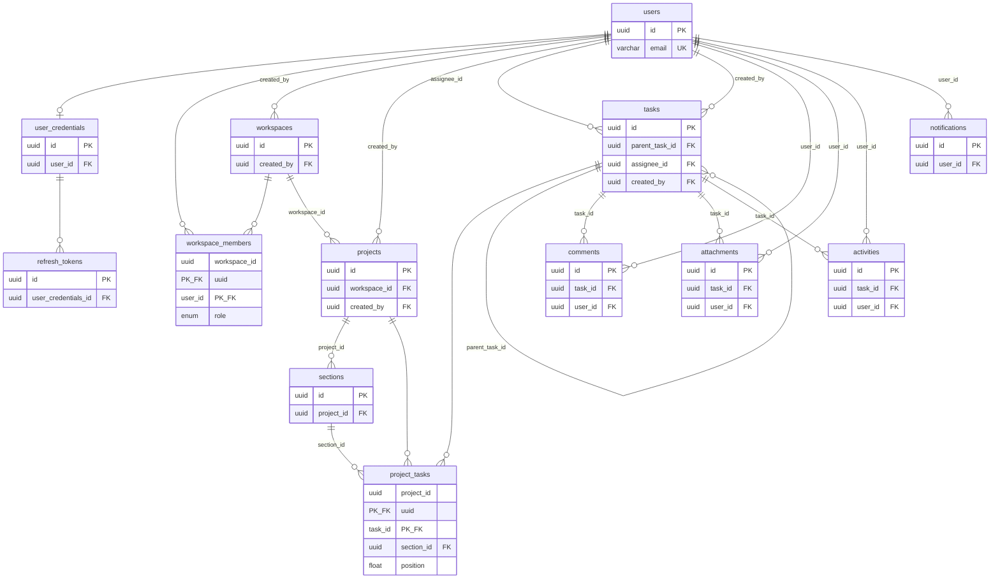

# Task Tracker Project — архитектура

## Принципы

- **Модульная архитектура**: каждый модуль содержит всё о себе — domain, infra, use cases, ws-контроллер
- **Доменные интерфейсы + операции**: модели — интерфейсы в `domain/models/`, бизнес-логика — чистые функции в `domain/operations/`. Prisma-генерированные типы структурно совместимы с доменными интерфейсами — маппинг не нужен. Use case работает только с абстракциями из `domain/`
- **DIP**: интерфейсы принадлежат потребителю (modules/*/domain/), реализации (infra/prisma/) импортируют их через `import type`
- **Full WebSocket**: один тонкий gateway-роутер, делегирует в ws-контроллер каждого модуля. REST — только auth и file upload
- **Real-time**: изменения задач, комментарии, уведомления — всё через WebSocket

## Технологический стек

- NestJS + TypeScript
- PostgreSQL + Prisma (миграции, `prisma migrate`)
- Redis (кэш, pub/sub для WebSocket scaling между инстансами)
- BullMQ (очереди: уведомления, email, тяжёлые операции)
- WebSocket через `@nestjs/websockets` + `socket.io`
- S3 / MinIO (вложения к задачам)
- JWT + Refresh tokens
- `class-validator` + `class-transformer` (DTO валидация)
- `@nestjs/event-emitter` (межмодульные события)

## Правила зависимостей

- Use case импортирует ТОЛЬКО из `domain/` — модели (интерфейсы), операции (функции), репозитории (интерфейсы), исключения. Никогда из `infra/`
- Use case МОЖЕТ инжектить репозитории/gateway своего и чужого модуля по интерфейсу (через DI-токен)
- modules/*/infra/prisma/ — репозитории; реализуют интерфейсы из domain/repositories/ через `import type` (DIP). Модели — в common/infra/prisma/schema.prisma
- modules/*/infra/prisma/ НЕ МОЖЕТ импортировать use cases, контроллеры, ws-контроллеры или DTO
- common/infra/prisma/ — Prisma schema, client, миграции; импортируется в app.module.ts
- common/ — шарится между модулями (pipes, decorators, utils, types)
- Кросс-модульный доступ к данным: модуль импортирует `*.infra.module.ts` другого модуля
- Gateway — тонкий роутер, не содержит логики, делегирует в ws-контроллер модулей

## Схема БД

```
users
├── id (uuid), email, name, avatar_url
├── created_at, updated_at

user_credentials
├── id (uuid), user_id (-> users)
├── password_hash

refresh_tokens
├── id (uuid), user_credentials_id (-> user_credentials)
├── token, expires_at
├── created_at

workspaces
├── id (uuid), name, slug
├── created_by (-> users), created_at

workspace_members                          — M2M junction: users <-> workspaces
├── workspace_id (-> workspaces) ┐ PK
├── user_id (-> users)           ┘
├── role (owner / admin / member), joined_at

projects
├── id (uuid), workspace_id (-> workspaces)
├── name, description, color, icon
├── view_type (list / board / timeline)
├── created_by (-> users), created_at, updated_at

sections
├── id (uuid), project_id (-> projects)
├── name, position (float)
├── created_at

tasks
├── id (uuid)
├── parent_task_id (-> tasks, nullable) — подзадачи
├── title, description (text)
├── status (open / in_progress / completed)
├── priority (none / low / medium / high / urgent)
├── assignee_id (-> users, nullable)
├── due_date (timestamptz, nullable)
├── completed_at (timestamptz, nullable)
├── created_by (-> users)
├── created_at, updated_at

project_tasks                              — M2M junction: projects <-> tasks
├── project_id (-> projects) ┐ PK
├── task_id (-> tasks)       ┘
├── section_id (-> sections, nullable) — позиция задачи в конкретном проекте
├── position (float) — порядок внутри секции (fractional indexing)

comments
├── id (uuid), task_id (-> tasks), user_id (-> users)
├── content (text)
├── created_at, updated_at

attachments
├── id (uuid), task_id (-> tasks), user_id (-> users)
├── file_name, file_url, file_size, mime_type
├── created_at

activities
├── id (uuid), task_id (-> tasks), user_id (-> users)
├── action (created / updated / completed / reopened / assigned / moved / commented)
├── changes (jsonb) — { field: "status", from: "open", to: "completed" }
├── created_at

notifications
├── id (uuid), user_id (-> users)
├── type (task_assigned / task_completed / comment_added / mentioned)
├── payload (jsonb)
├── is_read (boolean)
├── created_at
```

### ER-диаграмма



## Структура папок

```
src/
├── main.ts
├── app.module.ts
│
├── common/                                  # общее для всех модулей
│   ├── infra/
│   │   └── prisma/
│   │       ├── schema.prisma
│   │       ├── prisma.module.ts             # Prisma forRoot
│   │       └── prisma.service.ts
│   ├── decorators/
│   │   ├── current-user.decorator.ts
│   │   └── workspace-roles.decorator.ts
│   ├── filters/
│   │   ├── http-exception.filter.ts
│   │   └── ws-exception.filter.ts
│   └── pipes/
│       └── validation.pipe.ts
│   ├── utils/
│   │   └── pagination.ts
│   └── types/
│       ├── common.types.ts                 # PaginatedResult, New, Loaded
│       └── enums.ts
│
├── ws/
│   ├── web-socket.module.ts
│   └── web-socket.gateway.ts               # тонкий WS роутер
│
└── modules/
    │
    ├── auth/
    │   ├── auth.module.ts
    │   ├── auth.http.controller.ts
    │   │
    │   ├── domain/
    │   │   ├── di.tokens.ts
    │   │   ├── models/
    │   │   │   ├── user-credentials.ts      # userId, passwordHash
    │   │   │   └── refresh-token.ts         # userCredentialsId, token, expiresAt
    │   │   ├── types/
    │   │   │   └── auth.types.ts            # UserTokens, JwtPayload
    │   │   ├── repositories/
    │   │   │   └── auth-user.repository.ts  # единый репозиторий для credentials и refresh tokens
    │   │   └── exceptions/
    │   │       ├── invalid-credentials.ts
    │   │       ├── email-already-exists.ts
    │   │       └── invalid-refresh-token.ts
    │   │
    │   ├── infra/
    │   │   ├── auth.infra.module.ts
    │   │   └── prisma/
    │   │       └── auth-user.repository.ts
    │   │
    │   ├── use-cases/
    │   │   ├── register.case.ts
    │   │   ├── login.case.ts
    │   │   ├── refresh-tokens.case.ts
    │   │   ├── logout.case.ts
    │   │   ├── validate-token.case.ts
    │   │   └── dto/
    │   │       ├── register.dto.ts
    │   │       ├── login.dto.ts
    │   │       └── refresh-tokens.dto.ts
    │   │
    │   ├── strategies/
    │   │   ├── jwt.strategy.ts
    │   │   └── jwt-refresh.strategy.ts
    │   │
    │   └── index.ts
    │
    ├── user/
    │   ├── user.module.ts
    │   ├── user.ws.controller.ts
    │   │
    │   ├── domain/
    │   │   ├── di.tokens.ts
    │   │   ├── models/
    │   │   │   └── user.ts
    │   │   ├── repositories/
    │   │   │   └── user.repository.ts
    │   │   └── exceptions/
    │   │       └── user-not-found.ts
    │   │
    │   ├── infra/
    │   │   ├── user.infra.module.ts
    │   │   └── prisma/
    │   │       └── user.repository.ts
    │   │
    │   ├── use-cases/
    │   │   ├── get-profile.case.ts
    │   │   ├── update-profile.case.ts
    │   │   ├── upload-avatar.case.ts
    │   │   └── dto/
    │   │       └── update-profile.dto.ts
    │   │
    │   └── index.ts
    │
    ├── workspace/
    │   ├── workspace.module.ts
    │   ├── workspace.ws.controller.ts
    │   │
    │   ├── domain/
    │   │   ├── di.tokens.ts
    │   │   ├── models/
    │   │   │   ├── workspace.ts
    │   │   │   └── workspace-member.ts         # interface WorkspaceMember
    │   │   ├── operations/
    │   │   │   └── workspace-member.operations.ts  # assertCanInvite(), assertCanRemove()
    │   │   ├── repositories/
    │   │   │   ├── workspace.repository.ts
    │   │   │   └── workspace-member.repository.ts
    │   │   └── exceptions/
    │   │       ├── workspace-not-found.ts
    │   │       ├── already-member.ts
    │   │       └── insufficient-role.ts
    │   │
    │   ├── infra/
    │   │   ├── workspace.infra.module.ts
    │   │   └── prisma/
    │   │       ├── workspace.repository.ts
    │   │       └── workspace-member.repository.ts
    │   │
    │   ├── use-cases/
    │   │   ├── create-workspace.case.ts
    │   │   ├── update-workspace.case.ts
    │   │   ├── delete-workspace.case.ts
    │   │   ├── invite-member.case.ts
    │   │   ├── remove-member.case.ts
    │   │   ├── change-member-role.case.ts
    │   │   ├── list-workspaces.case.ts
    │   │   ├── list-members.case.ts
    │   │   └── dto/
    │   │       ├── create-workspace.dto.ts
    │   │       ├── update-workspace.dto.ts
    │   │       ├── invite-member.dto.ts
    │   │       └── change-member-role.dto.ts
    │   │
    │   └── index.ts
    │
    ├── project/
    │   ├── project.module.ts
    │   ├── project.ws.controller.ts
    │   │
    │   ├── domain/
    │   │   ├── di.tokens.ts
    │   │   ├── models/
    │   │   │   ├── project.ts
    │   │   │   └── section.ts
    │   │   ├── repositories/
    │   │   │   ├── project.repository.ts
    │   │   │   └── section.repository.ts
    │   │   └── exceptions/
    │   │       ├── project-not-found.ts
    │   │       └── section-not-found.ts
    │   │
    │   ├── infra/
    │   │   ├── project.infra.module.ts
    │   │   └── prisma/
    │   │       ├── project.repository.ts
    │   │       └── section.repository.ts
    │   │
    │   ├── use-cases/
    │   │   ├── create-project.case.ts
    │   │   ├── update-project.case.ts
    │   │   ├── delete-project.case.ts
    │   │   ├── get-project.case.ts
    │   │   ├── list-projects.case.ts
    │   │   ├── create-section.case.ts
    │   │   ├── update-section.case.ts
    │   │   ├── delete-section.case.ts
    │   │   ├── reorder-sections.case.ts
    │   │   └── dto/
    │   │       ├── create-project.dto.ts
    │   │       ├── update-project.dto.ts
    │   │       ├── create-section.dto.ts
    │   │       ├── update-section.dto.ts
    │   │       └── reorder-sections.dto.ts
    │   │
    │   └── index.ts
    │
    ├── task/
    │   ├── task.module.ts
    │   ├── task.ws.controller.ts
    │   │
    │   ├── domain/
    │   │   ├── di.tokens.ts
    │   │   ├── models/
    │   │   │   ├── task.ts                    # interface Task
    │   │   │   └── comment.ts                 # interface Comment (подсущность задачи)
    │   │   ├── operations/
    │   │   │   └── task.operations.ts          # completeTask(), reopenTask(), isOverdue()
    │   │   ├── repositories/
    │   │   │   ├── task.repository.ts
    │   │   │   └── comment.repository.ts
    │   │   └── exceptions/
    │   │       ├── task-not-found.ts
    │   │       ├── task-already-completed.ts
    │   │       └── comment-not-found.ts
    │   │
    │   ├── infra/
    │   │   ├── task.infra.module.ts
    │   │   └── prisma/
    │   │       ├── task.repository.ts
    │   │       └── comment.repository.ts
    │   │
    │   ├── use-cases/
    │   │   ├── task/
    │   │   │   ├── create-task.case.ts
    │   │   │   ├── update-task.case.ts
    │   │   │   ├── delete-task.case.ts
    │   │   │   ├── get-task.case.ts
    │   │   │   ├── list-tasks.case.ts
    │   │   │   ├── complete-task.case.ts
    │   │   │   ├── reopen-task.case.ts
    │   │   │   ├── assign-task.case.ts
    │   │   │   ├── move-task.case.ts
    │   │   │   └── create-subtask.case.ts
    │   │   ├── comment/
    │   │   │   ├── create-comment.case.ts
    │   │   │   ├── update-comment.case.ts
    │   │   │   ├── delete-comment.case.ts
    │   │   │   └── list-comments.case.ts
    │   │   └── dto/
    │   │       ├── task/
    │   │       │   ├── create-task.dto.ts
    │   │       │   ├── update-task.dto.ts
    │   │       │   ├── move-task.dto.ts
    │   │       │   ├── assign-task.dto.ts
    │   │       │   └── task-filter.dto.ts
    │   │       └── comment/
    │   │           ├── create-comment.dto.ts
    │   │           └── update-comment.dto.ts
    │   │
    │   └── index.ts
    │
    ├── notification/
    │   ├── notification.module.ts
    │   ├── notification.ws.controller.ts
    │   │
    │   ├── domain/
    │   │   ├── di.tokens.ts
    │   │   ├── models/
    │   │   │   └── notification.ts
    │   │   ├── repositories/
    │   │   │   └── notification.repository.ts
    │   │   └── exceptions/
    │   │
    │   ├── infra/
    │   │   ├── notification.infra.module.ts
    │   │   ├── prisma/
    │   │   │   └── notification.repository.ts
    │   │   │
    │   │   └── queue/
    │   │       ├── notification.producer.ts
    │   │       └── notification.consumer.ts
    │   │
    │   ├── use-cases/
    │   │   ├── list-notifications.case.ts
    │   │   ├── mark-as-read.case.ts
    │   │   ├── mark-all-as-read.case.ts
    │   │   ├── send-notification.case.ts    # @OnEvent('task.assigned'), @OnEvent('comment.created'), ...
    │   │   └── dto/
    │   │       └── notification-filter.dto.ts
    │   │
    │   └── index.ts
    │
    ├── activity/
    │   ├── activity.module.ts
    │   ├── activity.ws.controller.ts
    │   │
    │   ├── domain/
    │   │   ├── di.tokens.ts
    │   │   ├── models/
    │   │   │   └── activity.ts
    │   │   ├── repositories/
    │   │   │   └── activity.repository.ts
    │   │   └── exceptions/
    │   │
    │   ├── infra/
    │   │   ├── activity.infra.module.ts
    │   │   └── prisma/
    │   │       └── activity.repository.ts
    │   │
    │   ├── use-cases/
    │   │   ├── list-task-activity.case.ts
    │   │   ├── record-activity.case.ts      # @OnEvent('task.*') — записывает изменения
    │   │   └── dto/
    │   │       └── activity-filter.dto.ts
    │   │
    │   └── index.ts
    │
    ├── attachment/
    │   ├── attachment.module.ts
    │   ├── attachment.http.controller.ts
    │   │
    │   ├── domain/
    │   │   ├── di.tokens.ts
    │   │   ├── models/
    │   │   │   └── attachment.ts
    │   │   ├── repositories/
    │   │   │   └── attachment.repository.ts
    │   │   ├── gateways/
    │   │   │   └── storage.gateway.ts       # interface StorageGateway (upload, delete, getUrl)
    │   │   └── exceptions/
    │   │       ├── attachment-not-found.ts
    │   │       └── attachment-too-large.ts
    │   │
    │   ├── infra/
    │   │   ├── attachment.infra.module.ts
    │   │   ├── prisma/
    │   │   │   └── attachment.repository.ts
    │   │   │
    │   │   └── s3/
    │   │       └── s3.gateway.ts            # implements StorageGateway
    │   │
    │   ├── use-cases/
    │   │   ├── upload-attachment.case.ts
    │   │   ├── delete-attachment.case.ts
    │   │   ├── list-attachments.case.ts
    │   │   └── dto/
    │   │       └── upload-attachment.dto.ts
    │   │
    │   └── index.ts
    │
    └── search/
        ├── search.module.ts
        ├── search.ws.controller.ts
        │
        ├── use-cases/
        │   ├── search-tasks.case.ts
        │   └── dto/
        │       └── search.dto.ts
        │
        └── index.ts
```

## WebSocket архитектура

### Gateway — тонкий роутер

```typescript
// ws/web-socket.gateway.ts
@WebSocketGateway({ cors: true })
export class AppGateway {
  constructor(
    private readonly taskWsController: TaskWsController,
    private readonly notificationWsController: NotificationWsController,
    private readonly projectWsController: ProjectWsController,
    private readonly workspaceWsController: WorkspaceWsController,
  ) {}

  // Подписка на проект (все участники получают обновления задач)
  @SubscribeMessage('project:join')
  joinProject(client: Socket, projectId: string) {
    return this.projectWsController.join(client, projectId);
  }

  @SubscribeMessage('project:leave')
  leaveProject(client: Socket, projectId: string) {
    return this.projectWsController.leave(client, projectId);
  }

  // Задачи
  @SubscribeMessage('task:create')
  createTask(client: Socket, data: CreateTaskDto) {
    return this.taskWsController.create(client, data);
  }

  @SubscribeMessage('task:update')
  updateTask(client: Socket, data: UpdateTaskDto) {
    return this.taskWsController.update(client, data);
  }

  @SubscribeMessage('task:move')
  moveTask(client: Socket, data: MoveTaskDto) {
    return this.taskWsController.move(client, data);
  }

  // Комментарии
  @SubscribeMessage('comment:create')
  createComment(client: Socket, data: CreateCommentDto) {
    return this.commentWsController.create(client, data);
  }

  // Уведомления
  @SubscribeMessage('notification:mark-read')
  markNotificationRead(client: Socket, data: MarkNotificationReadDto) {
    return this.notificationWsController.markRead(client, data);
  }
}
```

### WS Controller — делегат в модуле

```typescript
// modules/task/task.ws.controller.ts
@Injectable()
export class TaskWsController {
  constructor(
    private readonly createTask: CreateTask,
    private readonly updateTask: UpdateTask,
    private readonly moveTask: MoveTask,
  ) {}

  async create(client: Socket, data: CreateTaskDto) {
    const task = await this.createTask.execute(data, client.data.userId);
    client.to(`project:${task.projectId}`).emit('task:created', task);
    return task;
  }

  async update(client: Socket, data: UpdateTaskDto) {
    const task = await this.updateTask.execute(data, client.data.userId);
    client.to(`project:${task.projectId}`).emit('task:updated', task);
    return task;
  }

  async move(client: Socket, data: MoveTaskDto) {
    const task = await this.moveTask.execute(data, client.data.userId);
    client.to(`project:${task.projectId}`).emit('task:moved', task);
    return task;
  }
}
```

### WebSocket комнаты

- `project:{projectId}` — все участники проекта, получают обновления задач и секций
- `user:{userId}` — персональный канал для уведомлений
- `task:{taskId}` — подписка на конкретную задачу (комментарии, activity)

### Real-time поток событий

```
User Action → WS Gateway → WS Controller → Use Case → Repository (save)
                                              ↓
                                        EventEmitter
                                       ↙     ↓      ↘
                              Activity    Notification   WS Broadcast
                              Service     Queue          (to room)
```

## Межмодульное общение — события

### Типы событий

```
task.created      → activity (запись), notification (если assignee)
task.updated      → activity (запись), ws broadcast
task.completed    → activity, notification (assignee + creator)
task.assigned     → activity, notification (новый assignee)
task.moved        → activity, ws broadcast
comment.created   → activity, notification (assignee + упомянутые)
comment.updated   → ws broadcast
member.invited    → notification
member.removed    → notification, ws broadcast
```

### Подписчики

```typescript
// modules/activity/use-cases/record-activity.case.ts
@OnEvent('task.created')
@OnEvent('task.updated')
@OnEvent('task.completed')
@OnEvent('task.assigned')
@OnEvent('task.moved')
async onTaskEvent(payload: TaskEventPayload) {
  await this.activityRepo.create({ ... });
}

// modules/notification/use-cases/send-notification.case.ts
@OnEvent('task.assigned')
async onTaskAssigned(payload: TaskAssignedPayload) {
  await this.notificationProducer.send({ ... });
}

@OnEvent('comment.created')
async onCommentCreated(payload: CommentCreatedPayload) {
  await this.notificationProducer.send({ ... });
}
```

## Доменные модели — интерфейсы + операции

Модели — **интерфейсы** (форма данных). Бизнес-логика — **чистые функции**.
Prisma-генерированные типы структурно совместимы с доменными интерфейсами — маппинг не нужен.

### Модель

```typescript
// modules/task/domain/models/task.ts
export interface Task {
  id: string;
  parentTaskId: string | null;
  title: string;
  description: string;
  status: TaskStatus;
  priority: TaskPriority;
  assigneeId: string | null;
  dueDate: Date | null;
  completedAt: Date | null;
  createdBy: string;
  createdAt: Date;
  updatedAt: Date;
}

// Связь задачи с проектом (M2M junction)
export interface ProjectTask {
  projectId: string;
  taskId: string;
  sectionId: string | null;
  position: number;
}
```

### Операции

```typescript
// modules/task/domain/operations/task.operations.ts
export function completeTask(task: Readonly<Task>): Pick<Task, 'status' | 'completedAt'> {
  if (task.status === 'completed') {
    throw new TaskAlreadyCompleted(task.id);
  }
  return { status: 'completed', completedAt: new Date() };
}

export function reopenTask(task: Readonly<Task>): Pick<Task, 'status' | 'completedAt'> {
  if (task.status !== 'completed') {
    throw new TaskNotCompleted(task.id);
  }
  return { status: 'open', completedAt: null };
}

export function isOverdue(task: Readonly<Task>): boolean {
  return task.dueDate !== null
    && task.status !== 'completed'
    && task.dueDate < new Date();
}
```

### Prisma-типы совместимы с доменными интерфейсами

Prisma генерирует типы из `schema.prisma`. Доменные интерфейсы описывают ту же структуру — Prisma-объекты удовлетворяют им без маппинга:

```typescript
// Prisma генерирует тип Task из schema.prisma (id, title, status, ...)
// Доменный интерфейс описывает ту же форму:
//   export interface Task { id: string; title: string; status: TaskStatus; ... }
// → prisma.task.findUnique(...) возвращает объект, совместимый с Task
```

### Use case — чистый от infra

```typescript
// modules/task/use-cases/complete-task.case.ts
import type { Task } from '../domain/models/task';
import { completeTask } from '../domain/operations/task.operations';

export class CompleteTaskCase {
  constructor(
    @Inject(TaskDI.REPOSITORY) private readonly taskRepo: TaskRepository,
    private readonly events: EventEmitter2,
  ) {}

  async execute(taskId: string, userId: string): Promise<Task> {
    const task = await this.taskRepo.findById(taskId);
    const changes = completeTask(task);
    const updated = await this.taskRepo.update(taskId, changes);
    this.events.emit(EVENTS.TASK.COMPLETED, { task: updated, userId });
    return updated;
  }
}
```

### Где нужны операции

| Модуль | operations/ | Почему |
|---|---|---|
| task | да | Статусы, завершение, переоткрытие, назначение |
| workspace | да | Проверки ролей участников |
| notification, activity, attachment | нет | Чистый CRUD, нет бизнес-правил |

## Контракты (DIP)

Интерфейсы лежат в `modules/*/domain/` — принадлежат потребителю.
Реализации в `infra/prisma/` импортируют их через `import type`.

```typescript
// modules/task/domain/repositories/task.repository.ts
export interface TaskRepository {
  findById(id: string): Promise<Task | null>;
  findByProject(projectId: string, filter?: TaskFilter): Promise<Task[]>;
  create(data: NewTask): Promise<Task>;
  update(id: string, data: Partial<Task>): Promise<Task>;
  remove(id: string): Promise<void>;
}

export interface ProjectTaskRepository {
  findByProject(projectId: string): Promise<ProjectTask[]>;
  findByTask(taskId: string): Promise<ProjectTask[]>;
  addTaskToProject(data: ProjectTask): Promise<ProjectTask>;
  removeTaskFromProject(projectId: string, taskId: string): Promise<void>;
  updatePosition(projectId: string, taskId: string, sectionId: string | null, position: number): Promise<ProjectTask>;
}

// modules/task/infra/prisma/task.repository.ts
import type { TaskRepository } from '../../../domain/repositories/task.repository';

@Injectable()
export class TaskRepositoryImpl implements TaskRepository {
  constructor(private readonly prisma: PrismaService) {}

  async findById(id: string): Promise<Task | null> {
    return this.prisma.task.findUnique({ where: { id } });
  }

  async update(id: string, data: Partial<Task>): Promise<Task> {
    return this.prisma.task.update({ where: { id }, data });
  }
  // ...
}
```

Связывание в infra-модуле:

```typescript
// modules/task/infra/task.infra.module.ts
@Module({
  imports: [PrismaModule],
  providers: [{ provide: TaskDI.REPOSITORY, useClass: TaskRepositoryImpl }],
  exports: [TaskDI.REPOSITORY],
})
export class TaskInfraModule {}
```

## Кросс-модульный доступ к данным

```typescript
// modules/task/task.module.ts
@Module({
  imports: [
    TaskInfraModule,                  // свой репозиторий
    ProjectInfraModule,               // ProjectDI.SECTION_REPOSITORY для MoveTask
    UserInfraModule,                  // UserDI.REPOSITORY для AssignTask
  ],
  providers: [
    TaskWsController,
    CreateTask, UpdateTask, DeleteTask,
    GetTask, ListTasks, CompleteTask,
    ReopenTask, AssignTask, MoveTask,
    CreateSubtask,
  ],
  exports: [TaskWsController],       // для Gateway
})
export class TaskModule {}
```

## Что МОЖНО и НЕЛЬЗЯ импортировать из другого модуля

- МОЖНО: `domain/**` (интерфейсы моделей, операции, DI-токены, исключения) — через `import type` или barrel `index.ts`
- МОЖНО: `infra/*.infra.module.ts` — для получения провайдеров через DI
- НЕЛЬЗЯ: `use-cases/*.case.ts` — вместо этого EventEmitter
- НЕЛЬЗЯ: `infra/prisma/**` — это реализации, зависимость только от интерфейсов в `domain/`

## Порядок разработки (MVP)

1. auth — регистрация, логин, JWT (REST)
2. WebSocket (ws/) — gateway + JWT auth на handshake
3. user — профиль (WS)
4. workspace — создание, участники, роли (WS)
5. project + sections — CRUD, структура (WS)
6. task — CRUD, статусы, назначение, перемещение, подзадачи, комментарии (WS)
7. activity — лента изменений (event-driven + WS чтение)
9. notification — in-app + WS push (через BullMQ)
10. file — загрузка вложений к задачам (REST)
11. search — полнотекстовый поиск по задачам (WS)

## Прочие правила

- Prisma — использовать миграции (`prisma migrate`)
- Каждый модуль экспортирует контракты из domain/ через barrel `index.ts`
- Fractional indexing для позиций задач и секций (drag-and-drop без пересчёта)
- Оптимистичные обновления на фронте: клиент показывает изменение сразу, сервер подтверждает через WS
- JSONB для activity changes — diff изменений в одной колонке
- Redis pub/sub для масштабирования WebSocket между несколькими инстансами
