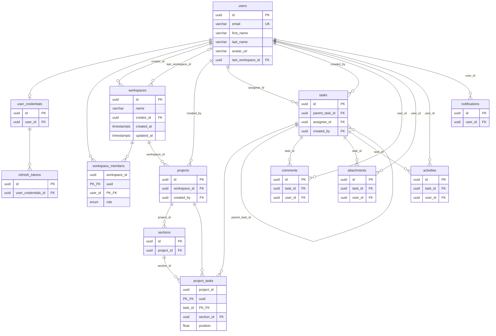

# Task Tracker Project — архитектура

## Принципы

- **Модульная архитектура**: каждый модуль содержит всё о себе — domain, infra, use cases, ws-контроллер
- **Доменные интерфейсы + операции**: модели — интерфейсы в `domain/models/`, бизнес-логика — чистые функции в `domain/operations/`. Prisma-генерированные типы структурно совместимы с доменными интерфейсами — маппинг не нужен. Use case работает только с абстракциями из `domain/`
- **DIP**: репозитории — конкретные классы в `domain/repositories/`, инжектят `PrismaService` (глобальный). Связываются с DI через `*.domain.module.ts`. Модели — интерфейсы, репозитории — классы
- **Full WebSocket**: один тонкий gateway-роутер, делегирует в ws-контроллер каждого модуля. REST — только auth и file upload
- **Real-time**: изменения задач, комментарии, уведомления — всё через WebSocket

## Технологический стек

- NestJS + TypeScript
- PostgreSQL + Prisma (миграции, `prisma migrate`, `prisma.config.ts`)
- `@nestjs/config` (конфигурация окружения)
- `nestjs-cls` (continuation-local storage для контекста транзакций)
- Redis (кэш, pub/sub для WebSocket scaling между инстансами)
- BullMQ (очереди: уведомления, email, тяжёлые операции)
- WebSocket через `@nestjs/websockets` + `socket.io`
- S3 / MinIO (вложения к задачам)
- JWT + Refresh tokens (через `@nestjs/jwt` + `@nestjs/passport`)
- `class-validator` + `class-transformer` (DTO валидация)
- `cookie-parser` (refresh token в httpOnly cookie)
- `@nestjs/event-emitter` (межмодульные события)

## Правила зависимостей

- Use case импортирует ТОЛЬКО из `domain/` — модели (интерфейсы), операции (функции), репозитории, исключения. Никогда из `infra/`
- Use case МОЖЕТ инжектить репозитории/gateway своего и чужого модуля (через DI — все они доступны через `*.domain.module.ts`)
- `core/*/domain/repositories/` — репозитории; конкретные классы, инжектят `PrismaService`. Схема БД — `common/infra/prisma/schema.prisma` и фрагменты в `common/infra/prisma/models/*.prisma`
- `core/*/domain/` НЕ МОЖЕТ импортировать use cases, контроллеры, ws-контроллеры или DTO
- `common/infra/prisma/` — Prisma schema, client, миграции; `PrismaModule` — `@Global()`, импортируется в `app.module.ts`
- `common/` — кросс-модульный код; подробно — в разделе «Слой `src/common/`» ниже
- Кросс-модульный доступ к данным: модуль импортирует `*.module.ts` другого модуля (репозитории доступны через реэкспорт из domain-модуля)
- Кросс-модульные JOIN-ы в репозиториях запрещены. Каждый модуль работает только со своими таблицами: не использовать Prisma `include`/`select` с relations на таблицы другого модуля. Если use case нужны данные из двух модулей — он получает их отдельными вызовами через репозитории каждого модуля. Ссылки на сущности другого модуля хранятся как `id: string`, без Prisma relation
- Gateway — тонкий роутер, не содержит логики, делегирует в ws-контроллер модулей

## Схема БД

```text
users
├── id (uuid), email, first_name, last_name, avatar_url
├── last_workspace_id (-> workspaces, nullable) — последний открытый workspace
├── created_at, updated_at

user_credentials
├── id (uuid), user_id (-> users)
├── password_hash

refresh_tokens
├── id (uuid), user_creds_id (-> user_credentials)
├── token, expires_at
├── created_at

workspaces
├── id (uuid), name,
├── creator_id (-> users), created_at, updated_at

workspace_members                          — M2M junction: users <-> workspaces
├── workspace_id (-> workspaces) ┐ PK
├── user_id (-> users)           ┘
├── role (owner / admin / member), joined_at

projects
├── id (uuid), workspace_id (-> workspaces)
├── name, description, color, icon
├── view_type (list / board / timeline)
├── created_by (-> users), created_at, updated_at

sections
├── id (uuid), project_id (-> projects)
├── name, position (float)
├── created_at

tasks
├── id (uuid)
├── parent_task_id (-> tasks, nullable) — подзадачи
├── title, description (text)
├── status (open / in_progress / completed)
├── priority (none / low / medium / high / urgent)
├── assignee_id (-> users, nullable)
├── due_date (timestamptz, nullable)
├── completed_at (timestamptz, nullable)
├── created_by (-> users)
├── created_at, updated_at

project_tasks                              — M2M junction: projects <-> tasks
├── project_id (-> projects) ┐ PK
├── task_id (-> tasks)       ┘
├── section_id (-> sections, nullable) — позиция задачи в конкретном проекте
├── position (float) — порядок внутри секции (fractional indexing)

comments
├── id (uuid), task_id (-> tasks), user_id (-> users)
├── content (text)
├── created_at, updated_at

attachments
├── id (uuid), task_id (-> tasks), user_id (-> users)
├── file_name, file_url, file_size, mime_type
├── created_at

activities
├── id (uuid), task_id (-> tasks), user_id (-> users)
├── action (created / updated / completed / reopened / assigned / moved / commented)
├── changes (jsonb) — { field: "status", from: "open", to: "completed" }
├── created_at

notifications
├── id (uuid), user_id (-> users)
├── type (task_assigned / task_completed / comment_added / mentioned)
├── payload (jsonb)
├── is_read (boolean)
├── created_at
```

### ER-диаграмма


```mermaid
erDiagram
    users ||--o| user_credentials : ""
    users ||--o{ workspace_members : ""
    workspaces ||--o{ workspace_members : ""
    users ||--o{ workspaces : "creator_id"
    users |o--o{ workspaces : "last_workspace_id"
    workspaces ||--o{ projects : "workspace_id"
    users ||--o{ projects : "created_by"
    projects ||--o{ sections : "project_id"
    projects ||--o{ project_tasks : ""
    tasks ||--o{ project_tasks : ""
    sections ||--o{ project_tasks : "section_id"
    tasks ||--o{ tasks : "parent_task_id"
    users ||--o{ tasks : "assignee_id"
    users ||--o{ tasks : "created_by"
    tasks ||--o{ comments : "task_id"
    users ||--o{ comments : "user_id"
    tasks ||--o{ attachments : "task_id"
    users ||--o{ attachments : "user_id"
    tasks ||--o{ activities : "task_id"
    users ||--o{ activities : "user_id"
    users ||--o{ notifications : "user_id"
    user_credentials ||--o{ refresh_tokens : ""

    users {
        uuid id PK
        varchar email UK
        varchar first_name
        varchar last_name
        varchar avatar_url
        uuid last_workspace_id FK
    }
    user_credentials {
        uuid id PK
        uuid user_id FK
    }
    refresh_tokens {
        uuid id PK
        uuid user_credentials_id FK
    }
    workspaces {
        uuid id PK
        varchar name
        uuid creator_id FK
        timestamptz created_at
        timestamptz updated_at
    }
    workspace_members {
        uuid workspace_id PK_FK
        uuid user_id PK_FK
        enum role
    }
    projects {
        uuid id PK
        uuid workspace_id FK
        uuid created_by FK
    }
    sections {
        uuid id PK
        uuid project_id FK
    }
    tasks {
        uuid id PK
        uuid parent_task_id FK
        uuid assignee_id FK
        uuid created_by FK
    }
    project_tasks {
        uuid project_id PK_FK
        uuid task_id PK_FK
        uuid section_id FK
        float position
    }
    comments {
        uuid id PK
        uuid task_id FK
        uuid user_id FK
    }
    attachments {
        uuid id PK
        uuid task_id FK
        uuid user_id FK
    }
    activities {
        uuid id PK
        uuid task_id FK
        uuid user_id FK
    }
    notifications {
        uuid id PK
        uuid user_id FK
    }
```

## Структура папок

```text
prisma.config.ts                            # Prisma 7: schema path, datasource

src/
├── main.ts
├── app.module.ts
│
├── common/                                 # кросс-модульный код
│   ├── decorators/
│   │   ├── index.ts                        # barrel: ValidateDto
│   │   └── validate-dto.decorator.ts
│   ├── exceptions/
│   │   ├── index.ts                        # barrel: DomainException, DtoFailed
│   │   ├── domain.exception.ts             # базовый класс для доменных ошибок в модулях
│   │   └── dto-failed.exception.ts         # прикладное исключение валидации DTO
│   ├── http/
│   │   └── filters/
│   │       ├── index.ts
│   │       ├── domain-exception.filter.ts
│   │       └── dto-validation-failed.filter.ts
│   ├── infra/
│   │   └── prisma/
│   │       ├── index.ts                    # barrel: PrismaModule, PrismaConnector, PrismaService, TransactionContext, TransactionRunner
│   │       ├── schema.prisma               # корень схемы: generator + datasource
│   │       ├── models/                     # фрагменты схемы
│   │       │   ├── user.prisma
│   │       │   ├── user-credentials.prisma
│   │       │   └── workspace.prisma
│   │       ├── migrations/
│   │       ├── prisma.module.ts            # @Global() — PrismaModule
│   │       ├── prisma.service.ts           # PrismaService: обёртка Prisma client
│   │       ├── prisma.connector.ts         # подключение к БД через pg adapter
│   │       ├── transaction-context.ts      # async-local контекст транзакций (nestjs-cls)
│   │       └── transaction.runner.ts       # TransactionRunner: runInTransaction()
│   └── types/
│       ├── index.ts                        # barrel: SystemFields, New, Updatable
│       └── generics.ts                     # New<T>, Updatable<T>, SystemFields
│
├── http/                                   # HTTP-слой (REST)
│   ├── http.module.ts
│   └── controllers/
│       └── auth.controller.ts
│
├── ws/                                     # WebSocket-слой
│   ├── web-socket.module.ts
│   └── web-socket.gateway.ts               # тонкий WS роутер
│
└── core/                                   # бизнес-модули
    │
    ├── auth/
    │   ├── auth.module.ts
    │   │
    │   ├── domain/
    │   │   ├── index.ts                    # barrel: модели, исключения
    │   │   ├── di.tokens.ts
    │   │   ├── auth.domain.module.ts        # JwtModule.registerAsync + providers: UserCredentialsRepository, PasswordHasher, TokenCodec
    │   │   ├── models/
    │   │   │   ├── user-credentials.ts      # userId, passwordHash
    │   │   │   └── refresh-token.ts         # userCredsId, token, expiresAt
    │   │   ├── types/
    │   │   │   └── index.ts                # UserTokens, AccessTokenPayload
    │   │   ├── repositories/
    │   │   │   └── user-credentials.repository.ts
    │   │   ├── tools/
    │   │   │   ├── password-hasher.ts
    │   │   │   └── token-codec.ts
    │   │   └── exceptions/
    │   │       ├── invalid-credentials.ts
    │   │       ├── email-already-exists.ts
    │   │       └── unauthorized.ts
    │   │
    │   └── use-cases/
    │       ├── index.ts                    # barrel: GetMeCase, ...
    │       ├── sign-up.case.ts
    │       ├── sign-in.case.ts
    │       ├── refresh-tokens.case.ts
    │       ├── logout.case.ts
    │       ├── get-me.case.ts
    │       └── dto/
    │           ├── sign-up.dto.ts
    │           ├── sign-in.dto.ts
    │           ├── refresh-tokens.dto.ts
    │           ├── logout.dto.ts
    │           └── get-me.dto.ts
    │
    ├── user/
    │   ├── user.module.ts
    │   │
    │   ├── domain/
    │   │   ├── index.ts                    # barrel: User + UserNotFound
    │   │   ├── di.tokens.ts
    │   │   ├── user.domain.module.ts        # providers: UserRepository
    │   │   ├── models/
    │   │   │   └── user.ts
    │   │   ├── repositories/
    │   │   │   └── user.repository.ts
    │   │   └── exceptions/
    │   │       └── user-not-found.ts
    │   │
    │   └── use-cases/
    │       ├── index.ts                    # barrel: GetUserCase
    │       ├── get-user.case.ts
    │       ├── update-user.case.ts
    │       ├── upload-avatar.case.ts
    │       └── dto/
    │           └── update-user.dto.ts
    │
    ├── workspace/
    │   ├── workspace.module.ts
    │   │
    │   ├── domain/
    │   │   ├── index.ts                    # barrel: Workspace, WorkspaceMember, WorkspaceMemberRole
    │   │   ├── di.tokens.ts
    │   │   ├── workspace.domain.module.ts   # providers: WorkspaceRepository, MemberRepository
    │   │   ├── models/
    │   │   │   ├── workspace.ts
    │   │   │   └── workspace-member.ts
    │   │   ├── repositories/
    │   │   │   ├── workspace.repository.ts
    │   │   │   └── member.repository.ts
    │   │   └── exceptions/
    │   │       ├── workspace-not-found.ts
    │   │       ├── already-member.ts
    │   │       └── insufficient-role.ts
    │   │
    │   └── use-cases/
    │       ├── index.ts
    │       ├── create-workspace.case.ts
    │       ├── update-workspace.case.ts
    │       ├── delete-workspace.case.ts
    │       ├── invite-member.case.ts
    │       ├── remove-member.case.ts
    │       ├── change-member-role.case.ts
    │       ├── list-workspaces.case.ts
    │       ├── list-members.case.ts
    │       └── dto/
    │           ├── create-workspace.dto.ts
    │           ├── update-workspace.dto.ts
    │           ├── invite-member.dto.ts
    │           └── change-member-role.dto.ts
    │
    ├── project/
    │   ├── project.module.ts
    │   ├── project.ws.controller.ts
    │   │
    │   ├── domain/
    │   │   ├── index.ts
    │   │   ├── di.tokens.ts
    │   │   ├── project.domain.module.ts
    │   │   ├── models/
    │   │   │   ├── project.ts
    │   │   │   └── section.ts
    │   │   ├── repositories/
    │   │   │   ├── project.repository.ts
    │   │   │   └── section.repository.ts
    │   │   └── exceptions/
    │   │       ├── project-not-found.ts
    │   │       └── section-not-found.ts
    │   │
    │   └── use-cases/
    │       ├── create-project.case.ts
    │       ├── update-project.case.ts
    │       ├── delete-project.case.ts
    │       ├── get-project.case.ts
    │       ├── list-projects.case.ts
    │       ├── create-section.case.ts
    │       ├── update-section.case.ts
    │       ├── delete-section.case.ts
    │       ├── reorder-sections.case.ts
    │       └── dto/
    │           ├── create-project.dto.ts
    │           ├── update-project.dto.ts
    │           ├── create-section.dto.ts
    │           ├── update-section.dto.ts
    │           └── reorder-sections.dto.ts
    │
    ├── task/
    │   ├── task.module.ts
    │   ├── task.ws.controller.ts
    │   │
    │   ├── domain/
    │   │   ├── index.ts
    │   │   ├── di.tokens.ts
    │   │   ├── task.domain.module.ts
    │   │   ├── models/
    │   │   │   ├── task.ts                    # interface Task
    │   │   │   └── comment.ts                 # interface Comment
    │   │   ├── operations/
    │   │   │   └── task.operations.ts          # completeTask(), reopenTask(), isOverdue()
    │   │   ├── repositories/
    │   │   │   ├── task.repository.ts
    │   │   │   └── comment.repository.ts
    │   │   └── exceptions/
    │   │       ├── task-not-found.ts
    │   │       ├── task-already-completed.ts
    │   │       └── comment-not-found.ts
    │   │
    │   └── use-cases/
    │       ├── task/
    │       │   ├── create-task.case.ts
    │       │   ├── update-task.case.ts
    │       │   ├── delete-task.case.ts
    │       │   ├── get-task.case.ts
    │       │   ├── list-tasks.case.ts
    │       │   ├── complete-task.case.ts
    │       │   ├── reopen-task.case.ts
    │       │   ├── assign-task.case.ts
    │       │   ├── move-task.case.ts
    │       │   └── create-subtask.case.ts
    │       ├── comment/
    │       │   ├── create-comment.case.ts
    │       │   ├── update-comment.case.ts
    │       │   ├── delete-comment.case.ts
    │       │   └── list-comments.case.ts
    │       └── dto/
    │           ├── task/
    │           │   ├── create-task.dto.ts
    │           │   ├── update-task.dto.ts
    │           │   ├── move-task.dto.ts
    │           │   ├── assign-task.dto.ts
    │           │   └── task-filter.dto.ts
    │           └── comment/
    │               ├── create-comment.dto.ts
    │               └── update-comment.dto.ts
    │
    ├── notification/
    │   ├── notification.module.ts
    │   ├── notification.ws.controller.ts
    │   │
    │   ├── domain/
    │   │   ├── index.ts
    │   │   ├── di.tokens.ts
    │   │   ├── notification.domain.module.ts
    │   │   ├── models/
    │   │   │   └── notification.ts
    │   │   ├── repositories/
    │   │   │   └── notification.repository.ts
    │   │   └── exceptions/
    │   │
    │   ├── infra/
    │   │   └── queue/
    │   │       ├── notification.producer.ts
    │   │       └── notification.consumer.ts
    │   │
    │   └── use-cases/
    │       ├── list-notifications.case.ts
    │       ├── mark-as-read.case.ts
    │       ├── mark-all-as-read.case.ts
    │       ├── send-notification.case.ts    # @OnEvent('task.assigned'), @OnEvent('comment.created'), ...
    │       └── dto/
    │           └── notification-filter.dto.ts
    │
    ├── activity/
    │   ├── activity.module.ts
    │   ├── activity.ws.controller.ts
    │   │
    │   ├── domain/
    │   │   ├── index.ts
    │   │   ├── di.tokens.ts
    │   │   ├── activity.domain.module.ts
    │   │   ├── models/
    │   │   │   └── activity.ts
    │   │   ├── repositories/
    │   │   │   └── activity.repository.ts
    │   │   └── exceptions/
    │   │
    │   └── use-cases/
    │       ├── list-task-activity.case.ts
    │       ├── record-activity.case.ts      # @OnEvent('task.*') — записывает изменения
    │       └── dto/
    │           └── activity-filter.dto.ts
    │
    ├── attachment/
    │   ├── attachment.module.ts
    │   ├── attachment.http.controller.ts
    │   │
    │   ├── domain/
    │   │   ├── index.ts
    │   │   ├── di.tokens.ts
    │   │   ├── attachment.domain.module.ts
    │   │   ├── models/
    │   │   │   └── attachment.ts
    │   │   ├── repositories/
    │   │   │   └── attachment.repository.ts
    │   │   ├── gateways/
    │   │   │   └── storage.gateway.ts       # interface StorageGateway (upload, delete, getUrl)
    │   │   └── exceptions/
    │   │       ├── attachment-not-found.ts
    │   │       └── attachment-too-large.ts
    │   │
    │   ├── infra/
    │   │   └── s3/
    │   │       └── s3.gateway.ts            # implements StorageGateway
    │   │
    │   └── use-cases/
    │       ├── upload-attachment.case.ts
    │       ├── delete-attachment.case.ts
    │       ├── list-attachments.case.ts
    │       └── dto/
    │           └── upload-attachment.dto.ts
    │
    └── search/
        ├── search.module.ts
        ├── search.ws.controller.ts
        │
        ├── use-cases/
        │   ├── search-tasks.case.ts
        │   └── dto/
        │       └── search.dto.ts
        │
        └── index.ts
```

### Слой `src/common/`

**Идея:** код в `common/` группируется по назначению — исключения, декораторы, типы, фильтры, инфраструктура Prisma.

**Куда класть артефакт:**

| Артефакт | Папка |
| --- | --- |
| Базовый класс доменного исключения | `exceptions/` |
| Прикладные исключения (не домен) | `exceptions/` |
| Общие типы и generics (`New<T>`, `Updatable<T>`, `TransactionRunner`) | `types/` |
| Декораторы валидации DTO | `decorators/` |
| Prisma, контекст транзакций, обвязка БД | `infra/prisma/` |
| HTTP exception filters | `http/filters/` |
| WS-специфичные фильтры/guards (когда появятся) | `ws/filters/`, `ws/guards/` — по аналогии с `http/` |

Модульные доменные исключения (`EmailAlreadyExists`, `TaskNotFound` и т.д.) остаются в `core/*/domain/exceptions/`, а не в `common/`.

**Импорты** (алиасы в `tsconfig.json`):

```json
{
  "@core/*":    ["src/core/*"],
  "@common/*":  ["src/common/*"],
  "@http/*":    ["src/http/*"],
  "@ws/*":      ["src/ws/*"]
}
```

Предпочтительные пути:

| Назначение | Путь |
| --- | --- |
| Доменные исключения | `@common/exceptions` |
| Прикладные исключения | `@common/exceptions` |
| Декораторы валидации DTO | `@common/decorators` |
| Общие типы | `@common/types` |
| `PrismaModule`, `PrismaService`, транзакции | `@common/infra/prisma` |
| HTTP filters | `@common/http/filters` |

Предпочтительны импорты через barrel-файлы (`index.ts`), а не глубокие пути к отдельным файлам.

**Антипаттерны:** файлы в корне `common/` без папки; смешение доменных и прикладных исключений в одной папке; реэкспорт через `infra/*/index.ts` артефактов родительских слоёв; вынос в общий слой исключений, которые использует один модуль.

## WebSocket архитектура

### Gateway — тонкий роутер

```typescript
// ws/web-socket.gateway.ts
@WebSocketGateway({ cors: true })
export class AppGateway {
  constructor(
    private readonly taskWsController: TaskWsController,
    private readonly notificationWsController: NotificationWsController,
    private readonly projectWsController: ProjectWsController,
    private readonly workspaceWsController: WorkspaceWsController,
  ) {}

  // Подписка на проект (все участники получают обновления задач)
  @SubscribeMessage('project:join')
  joinProject(client: Socket, projectId: string) {
    return this.projectWsController.join(client, projectId);
  }

  @SubscribeMessage('project:leave')
  leaveProject(client: Socket, projectId: string) {
    return this.projectWsController.leave(client, projectId);
  }

  // Задачи
  @SubscribeMessage('task:create')
  createTask(client: Socket, data: CreateTaskDto) {
    return this.taskWsController.create(client, data);
  }

  @SubscribeMessage('task:update')
  updateTask(client: Socket, data: UpdateTaskDto) {
    return this.taskWsController.update(client, data);
  }

  @SubscribeMessage('task:move')
  moveTask(client: Socket, data: MoveTaskDto) {
    return this.taskWsController.move(client, data);
  }

  // Комментарии
  @SubscribeMessage('comment:create')
  createComment(client: Socket, data: CreateCommentDto) {
    return this.commentWsController.create(client, data);
  }

  // Уведомления
  @SubscribeMessage('notification:mark-read')
  markNotificationRead(client: Socket, data: MarkNotificationReadDto) {
    return this.notificationWsController.markRead(client, data);
  }
}
```

### WS Controller — делегат в модуле

```typescript
// core/task/task.ws.controller.ts
@Injectable()
export class TaskWsController {
  constructor(
    private readonly createTask: CreateTask,
    private readonly updateTask: UpdateTask,
    private readonly moveTask: MoveTask,
  ) {}

  async create(client: Socket, data: CreateTaskDto) {
    const task = await this.createTask.execute(data, client.data.userId);
    client.to(`project:${task.projectId}`).emit('task:created', task);
    return task;
  }

  async update(client: Socket, data: UpdateTaskDto) {
    const task = await this.updateTask.execute(data, client.data.userId);
    client.to(`project:${task.projectId}`).emit('task:updated', task);
    return task;
  }

  async move(client: Socket, data: MoveTaskDto) {
    const task = await this.moveTask.execute(data, client.data.userId);
    client.to(`project:${task.projectId}`).emit('task:moved', task);
    return task;
  }
}
```

### WebSocket комнаты

- `project:{projectId}` — все участники проекта, получают обновления задач и секций
- `user:{userId}` — персональный канал для уведомлений
- `task:{taskId}` — подписка на конкретную задачу (комментарии, activity)

### Real-time поток событий

```text
User Action → WS Gateway → WS Controller → Use Case → Repository (save)
                                              ↓
                                        EventEmitter
                                       ↙     ↓      ↘
                              Activity    Notification   WS Broadcast
                              Service     Queue          (to room)
```

## Межмодульное общение — события

### Типы событий

```text
task.created      → activity (запись), notification (если assignee)
task.updated      → activity (запись), ws broadcast
task.completed    → activity, notification (assignee + creator)
task.assigned     → activity, notification (новый assignee)
task.moved        → activity, ws broadcast
comment.created   → activity, notification (assignee + упомянутые)
comment.updated   → ws broadcast
member.invited    → notification
member.removed    → notification, ws broadcast
```

### Подписчики

```typescript
// core/activity/use-cases/record-activity.case.ts
@OnEvent('task.created')
@OnEvent('task.updated')
@OnEvent('task.completed')
@OnEvent('task.assigned')
@OnEvent('task.moved')
async onTaskEvent(payload: TaskEventPayload) {
  await this.activityRepo.create({ ... });
}

// core/notification/use-cases/send-notification.case.ts
@OnEvent('task.assigned')
async onTaskAssigned(payload: TaskAssignedPayload) {
  await this.notificationProducer.send({ ... });
}

@OnEvent('comment.created')
async onCommentCreated(payload: CommentCreatedPayload) {
  await this.notificationProducer.send({ ... });
}
```

## Доменные модели — интерфейсы + операции

Модели — **интерфейсы** (форма данных). Бизнес-логика — **чистые функции**.
Prisma-генерированные типы структурно совместимы с доменными интерфейсами — маппинг не нужен.

### Модель

```typescript
// core/task/domain/models/task.ts
export interface Task {
  id: string;
  parentTaskId: string | null;
  title: string;
  description: string;
  status: TaskStatus;
  priority: TaskPriority;
  assigneeId: string | null;
  dueDate: Date | null;
  completedAt: Date | null;
  createdBy: string;
  createdAt: Date;
  updatedAt: Date;
}

// Связь задачи с проектом (M2M junction)
export interface ProjectTask {
  projectId: string;
  taskId: string;
  sectionId: string | null;
  position: number;
}

// core/user/domain/models/user.ts
export interface User {
  id: string;
  firstName: string;
  lastName: string;
  email: string;
  avatarUrl: string;
  lastWorkspaceId: string | null;
  createdAt: string;
  updatedAt: string;
}
```

### Операции

Операции — **иммутабельные чистые функции**. Принимают `Readonly<T>`, возвращают новый объект. Никогда не мутируют входной аргумент. Не имеют побочных эффектов (кроме выброса доменных исключений).

Если операция изменяет данные модели — она возвращает полную модель (`T`), а не частичный объект. Use case получает готовый результат и не собирает модель по частям.

```typescript
// core/task/domain/operations/task.operations.ts
export function completeTask(task: Readonly<Task>): Task {
  if (task.status === 'completed') {
    throw new TaskAlreadyCompleted(task.id);
  }
  return { ...task, status: 'completed', completedAt: new Date() };
}

export function reopenTask(task: Readonly<Task>): Task {
  if (task.status !== 'completed') {
    throw new TaskNotCompleted(task.id);
  }
  return { ...task, status: 'open', completedAt: null };
}

export function isOverdue(task: Readonly<Task>): boolean {
  return task.dueDate !== null
    && task.status !== 'completed'
    && task.dueDate < new Date();
}
```

### Prisma-типы совместимы с доменными интерфейсами

Prisma генерирует типы из `schema.prisma`. Доменные интерфейсы описывают ту же структуру — Prisma-объекты удовлетворяют им без маппинга:

```typescript
// Prisma генерирует тип Task из schema.prisma (id, title, status, ...)
// Доменный интерфейс описывает ту же форму:
//   export interface Task { id: string; title: string; status: TaskStatus; ... }
// → prisma.task.findUnique(...) возвращает объект, совместимый с Task
```

### Use case — чистый от infra

```typescript
// core/task/use-cases/complete-task.case.ts
import type { Task } from '../domain/models/task';
import { completeTask } from '../domain/operations/task.operations';

export class CompleteTaskCase {
  constructor(
    private readonly taskRepo: TaskRepository,
    private readonly events: EventEmitter2,
  ) {}

  async execute(taskId: string, userId: string): Promise<Task> {
    const task = await this.taskRepo.findById(taskId);
    const completed = completeTask(task);
    const saved = await this.taskRepo.update(completed);
    this.events.emit(EVENTS.TASK.COMPLETED, { task: saved, userId });
    return saved;
  }
}
```

### Где нужны операции

| Модуль | operations/ | Почему |
| --- | --- | --- |
| task | да | Статусы, завершение, переоткрытие, назначение |
| workspace | да | Проверки ролей участников |
| notification, activity, attachment | нет | Чистый CRUD, нет бизнес-правил |

## Контракты (DIP)

Репозитории — **конкретные классы** в `core/*/domain/repositories/`. Инжектят `PrismaService` напрямую.
`PrismaModule` — `@Global()`, доступен во всех модулях без явного импорта.
DI-связывание — через `*.domain.module.ts`, который провайдит и экспортирует репозитории.

```typescript
// core/user/domain/repositories/user.repository.ts
import { Injectable } from '@nestjs/common';
import { PrismaService } from '@common/infra/prisma';

@Injectable()
export class UserRepository {
  constructor(private readonly prisma: PrismaService) {}

  async findById(id: string): Promise<User | null> {
    return this.prisma.db.user.findUnique({ where: { id } });
  }

  async create(data: New<User>): Promise<User> {
    return this.prisma.db.user.create({ data });
  }

  async update(id: string, data: Updatable<User>): Promise<User> {
    return this.prisma.db.user.update({ where: { id }, data });
  }

  async remove(id: string): Promise<void> {
    await this.prisma.db.user.delete({ where: { id } });
  }
}
```

```typescript
// core/user/domain/user.domain.module.ts
import { Module } from '@nestjs/common';
import { UserRepository } from './repositories/user.repository';

@Module({
  providers: [UserRepository],
  exports: [UserRepository],
})
export class UserDomainModule {}
```

```typescript
// core/user/user.module.ts — application-модуль, импортирует domain и провайдит use cases
import { Module } from '@nestjs/common';
import { UserDomainModule } from './domain/user.domain.module';
import { GetUserCase } from './use-cases/get-user.case';

@Module({
  imports: [UserDomainModule],
  providers: [GetUserCase],
  exports: [GetUserCase, UserDomainModule],
})
export class UserModule {}
```

## Кросс-модульный доступ к данным

```typescript
// core/task/task.module.ts
@Module({
  imports: [
    TaskDomainModule,                  // свой репозиторий
    ProjectDomainModule,               // репозитории project/section
    UserDomainModule,                  // UserRepository
  ],
  providers: [
    TaskWsController,
    CreateTask, UpdateTask, DeleteTask,
    GetTask, ListTasks, CompleteTask,
    ReopenTask, AssignTask, MoveTask,
    CreateSubtask,
  ],
  exports: [TaskWsController],       // для Gateway
})
export class TaskModule {}
```

## Что МОЖНО и НЕЛЬЗЯ импортировать из другого модуля

- МОЖНО: `domain/**` (интерфейсы моделей, DI-токены, исключения) — через barrel `index.ts`
- МОЖНО: `*.module.ts` — для получения провайдеров через DI (репозитории реэкспортятся из domain-модуля)
- НЕЛЬЗЯ: `use-cases/*.case.ts` — вместо этого EventEmitter
- НЕЛЬЗЯ: детали реализации репозиториев напрямую — зависимость только через DI

## Порядок разработки (MVP)

1. auth — регистрация, логин, JWT (REST)
2. WebSocket (ws/) — gateway + JWT auth на handshake
3. user — профиль (WS)
4. workspace — создание, участники, роли (WS)
5. project + sections — CRUD, структура (WS)
6. task — CRUD, статусы, назначение, перемещение, подзадачи, комментарии (WS)
7. activity — лента изменений (event-driven + WS чтение)
8. notification — in-app + WS push (через BullMQ)
9. file — загрузка вложений к задачам (REST)
10. search — полнотекстовый поиск по задачам (WS)

## Прочие правила

- Prisma — использовать миграции (`prisma migrate`)
- `PrismaModule` — `@Global()`, доступен во всех модулях без явного импорта
- Каждый модуль экспортирует контракты из domain/ через barrel `index.ts`
- Fractional indexing для позиций задач и секций (drag-and-drop без пересчёта)
- Оптимистичные обновления на фронте: клиент показывает изменение сразу, сервер подтверждает через WS
- JSONB для activity changes — diff изменений в одной колонке
- Redis pub/sub для масштабирования WebSocket между несколькими инстансами
