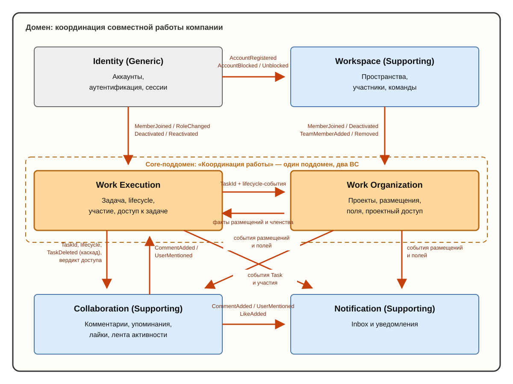

# Карта контекстов

> Актуальная карта bounded contexts после итераций 01–02. Стрелка: upstream → downstream (от поставщика фактов к потребителю). Подробности — в `docs/domain-model.md` и `docs/bc/0N-*.md`.

## Назначение контекстов

Класс — свойство поддомена, который реализует контекст, а не самого контекста. Карта почти выровнена 1:1; единственное отклонение: Work Execution и Work Organization — два BC одного core-поддомена «Координация работы» (единственный core продукта: Asana отличается не задачами и не проектами по отдельности, а тем, как они работают вместе). Collaboration — отдельный supporting-BC: основание выделения — собственное состояние и инварианты (комментарии, лайки, лента активности), а не размер механики.

| Контекст | Класс | Отвечает на вопрос | Не отвечает на вопрос |
| --- | --- | --- | --- |
| **Identity** | Generic | «Этот человек существует? Он — тот, за кого себя выдаёт?» | «Что ему можно?» |
| **Workspace** | Supporting | «Какие пространства есть? Кто в них состоит и в какой роли? Как устроены отделы?» | «Что участнику можно делать с задачами и проектами?» |
| **Work Execution** | Core | «Что за работа, кто отвечает, в каком она состоянии, кто участвует?» | «Как работа разложена по проектам? Что вокруг неё обсуждают?» |
| **Work Organization** | Core | «Как работа организована в проекты: структура, секции, поля, видимость, кто в проекте?» | «Что происходит с самой задачей глобально?» |
| **Collaboration** | Supporting | «Что обсуждают вокруг работы? Кто отреагировал? Что происходило с объектом?» | «В каком состоянии работа и кто в ней участвует?» |
| **Notification** | Supporting | «Что значимого произошло с моей работой? Что я прочитал, что отложил?» | Ничего не решает о работе — только реагирует |

## Ключевые связи

- **Identity → Workspace**: `AccountId` и события жизненного цикла аккаунта. Регистрация → персональный Workspace; блокировка → деактивация memberships (с причиной).
- **Workspace → рабочие контексты**: факты членства и команд в терминах `WorkspaceMemberId` (не `AccountId`). Деактивация участника → отзыв доступа в рабочих контекстах. Стрелка Workspace → Collaboration на схеме опущена ради читаемости — Collaboration получает те же факты участников.
- **Work Execution ⇄ Work Organization** (partnership двух BC одного core-поддомена): Execution публикует `TaskId` и lifecycle; Organization даёт факты размещений/членства для `TaskAccessPolicy`. Ни один не хранит состояние другого как источник истины.
- **Work Execution ⇄ Collaboration**: Execution даёт `TaskId`, lifecycle-события (включая `TaskDeleted` → каскад обсуждения и ленты) и вердикт доступа на комментирование; Collaboration публикует `CommentAdded` / `UserMentioned`, на которые Execution отвечает политикой участия.
- **Work Organization → Collaboration**: события размещений и полей — материал ленты активности.
- **Рабочие контексты и Collaboration → Notification**: только события, eventual consistency; сбой Notification не откатывает работу; обратных вызовов нет. Лента активности (Collaboration) и Inbox (Notification) — две разные модели, читающие одни и те же события.
