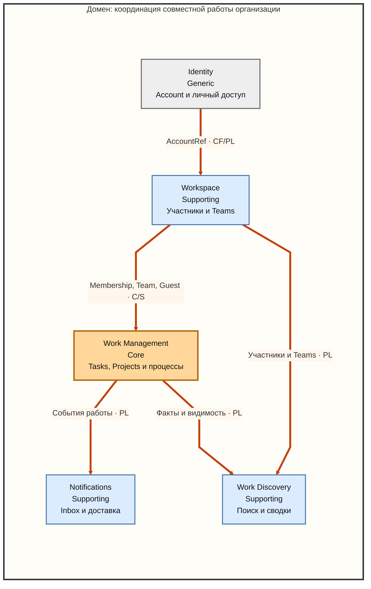

# Context Map

> Результат шага 5 стратегического анализа DDD.
>
> Статус: подтверждено пользователем 05.09.2026.

## Назначение

Карта фиксирует принятые ограниченные контексты, границы их моделей и отношения влияния между ними. Она описывает стратегическую модель, а не процессы, сетевые вызовы, модули NestJS или физическое размещение данных.

Одна стрелка означает `Upstream → Downstream`: контекст слева или сверху владеет публичным бизнесовым контрактом, а контекст на конце стрелки использует этот контракт. Направление зависимости не обозначает важность контекста.

## Контексты и субдомены

| Bounded Context   | Субдомен                  | Класс      |
| ----------------- | ------------------------- | ---------- |
| Identity          | Identity                  | Generic    |
| Workspace         | Организационное участие   | Supporting |
| Work Management   | Управление работой        | Core       |
| Notifications     | Notifications             | Supporting |
| Work Discovery    | Поиск и обзор работы      | Supporting |

Текущее соответствие получилось `один Subdomain → один Bounded Context`, но это результат проверки границ, а не общее правило DDD.

## Карта

Визуальная версия: [context-map.svg](context-map.svg).

## Типы отношений

| Обозначение | Паттерн             | Смысл                                                                                           |
| ----------- | ------------------- | ----------------------------------------------------------------------------------------------- |
| `C/S`       | Customer / Supplier | Downstream является потребителем результата и может влиять на развитие публичного контракта     |
| `CF`        | Conformist          | Downstream принимает публичный язык Upstream, не заставляя его знать о собственной модели       |
| `PL`        | Published Language  | Контексты используют небольшой согласованный язык фактов и ссылок вместо внутренних моделей друг друга |

`ACL` пока не используется: все пять моделей принадлежат одному продукту, а их публичные контракты можно сразу сделать узкими. Если внешний поставщик идентификации появится позднее, его модель будет изолироваться внутри `Identity`.

## Отношения

### Identity → Workspace

- **Upstream:** `Identity`.
- **Downstream:** `Workspace`.
- **Передаётся:** стабильная ссылка `AccountRef` и допустимый публичный факт о состоянии Account.
- **Отношение:** `Conformist + Published Language`.
- **Смысл:** Workspace связывает Membership с подтверждённой Account, но Identity ничего не знает о Workspace, Teams и ролях.

### Workspace → Work Management

- **Upstream:** `Workspace`.
- **Downstream:** `Work Management`.
- **Передаётся:** сведения о Member, Guest, Team Membership и организационных политиках.
- **Отношение:** `Customer / Supplier`.
- **Смысл:** Work Management использует организационное участие при назначениях и проверке действий, но самостоятельно владеет доступом к конкретным Tasks и Projects. Потребности Core учитываются при развитии публичного контракта Workspace.

### Work Management → Notifications

- **Upstream:** `Work Management`.
- **Downstream:** `Notifications`.
- **Передаётся:** значимые события работы, инициатор и связанные с работой получатели.
- **Отношение:** `Published Language`.
- **Смысл:** Notifications создаёт персональные сообщения, но не владеет Task, Collaborator или правами доступа. Ошибка уведомления не отменяет произошедшее изменение работы.

### Work Management → Work Discovery

- **Upstream:** `Work Management`.
- **Downstream:** `Work Discovery`.
- **Передаётся:** факты о Tasks, Projects, Custom Fields, Project Status и видимости работы.
- **Отношение:** `Published Language`.
- **Смысл:** Work Discovery строит поиск и обзоры, но не становится источником истины о работе или доступе к ней.

### Workspace → Work Discovery

- **Upstream:** `Workspace`.
- **Downstream:** `Work Discovery`.
- **Передаётся:** доступные участники, Guests, Teams и состояние Membership.
- **Отношение:** `Published Language`.
- **Смысл:** поиск людей и Teams использует организационные факты, не копируя правила Workspace в свою модель.

## Проверка границ

### Одна Task в нескольких Projects

`Work Management` владеет общей Task, всеми её размещениями и Rules. Глобальное завершение, проектные Statuses и автоматическая реакция остаются внутри одной модели; `Notifications` и `Work Discovery` получают уже произошедшие факты.

### Guest комментирует Task

`Identity` подтверждает Account, `Workspace` владеет Guest Membership, а `Work Management` предоставляет доступ к конкретной Task и сохраняет комментарий. `Notifications` создаёт персональные сообщения остальным участникам.

### Пользователь упомянут в комментарии

`Work Management` проверяет допустимость действия, сохраняет комментарий, упоминание и отношение Collaborator. `Notifications` не владеет подпиской на Task и получает только факт и аудиторию для персональных сообщений. Обратной зависимости не возникает.

### Form создаёт работу

Form, Task, Project, Fields и Rules находятся в `Work Management`. Создание и начальная маршрутизация не превращаются в распределённую цепочку между несколькими Core-контекстами. Результат публикуется в `Notifications` и `Work Discovery`.

### Offboarding

`Workspace` прекращает Membership. `Work Management` реагирует на исчезновение организационного источника доступа, проверяет оставшиеся источники и перераспределяет ответственность. `Work Discovery` перестаёт показывать недоступную работу.

## Принятые решения о границах

- Обсуждение работы остаётся внутри `Work Management`: комментарии, упоминания и Collaborators не имеют самостоятельной цели вне Task.
- Forms, Templates и Rules остаются внутри `Work Management` как язык настройки рабочих процессов.
- My Tasks остаётся внутри `Work Management`, потому что организует ту же Task, а не создаёт другой вид работы.
- Отдельный Access Context не создаётся: Workspace владеет организационным участием, а Work Management — полномочиями относительно конкретной работы.
- Notifications владеет персональным сообщением и Inbox, но не участием в Task.
- Work Discovery владеет поисковыми и обзорными моделями, но не состоянием Tasks, Projects или Membership.

## Открытые вопросы

- Точное внутреннее различие между Collaborator, прямым доступом и подпиской на Task относится к последующему тактическому моделированию внутри `Work Management`.
- Принадлежность Custom Field Value общей Task или конкретному размещению также исследуется внутри `Work Management` и не меняет текущую границу BC.
- При восстановлении Membership `Workspace` определяет организационное участие, а точное восстановление доступов к работе остаётся продуктовым правилом взаимодействия с `Work Management`.
- Если модель сохранённых запросов и dashboards останется тривиальной, `Work Discovery` можно пересмотреть и реализовать внутри `Work Management`. Для зрелого продукта он принят отдельным BC.
