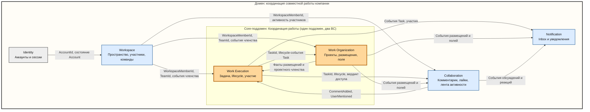

# Task Tracker: Domain Model

> Статус: стратегический фундамент, зафиксирован по итогам discovery-штурма. Живой документ.
>
> Документ описывает предметную модель, а не структуру каталогов, Prisma schema, HTTP API или набор модулей. Тактические элементы являются кандидатами, пока их границы не подтверждены инвариантами в детальных итерациях по bounded contexts (см. раздел «План discovery»).
>
> Продукт — осознанная копия Asana (охват: минимум + уведомления). Там, где поведение Asana известно, оно является решением по умолчанию; отклонения фиксируются явно в разделе «Расхождения с реальной Asana».

## Домен

Домен продукта — координация совместной работы внутри компании. Пользователи создают задачи, назначают ответственных, организуют одну и ту же работу в разных проектах, обсуждают её и получают персональные уведомления о значимых изменениях. Задача остаётся единым рабочим объектом независимо от количества проектов, а каждый проект предоставляет собственный способ группировки и представления этой задачи. Главная ценность продукта — дать компании единое пространство для видимости работы, ответственности и гибкой организации процессов разных отделов.

### Жизненные роли в домене

- **Постановщики работы** — превращают намерения в единицы работы: менеджеры, тимлиды, коллеги-заказчики. Им важно поручить и не потерять.
- **Исполнители** — делают работу. Им важно видеть свою работу и понимать, что делать следующим (в Asana: My Tasks и принцип DRI — один прямо ответственный).
- **Наблюдатели и координаторы** — руководство, смежные команды. Им нужно видеть: на каком этапе, кто отвечает, где застряло.
- **Организация как структура** — неявный участник: у отделов свои устоявшиеся процессы, и инструмент обязан их уважать.

Один человек обычно совмещает несколько ролей. Роли жизненные, а не системные: из них рождаются сценарии, а не наоборот.

### Боль, которую снимает продукт

- **Невидимость.** Состояние работы узнаётся только расспросом; компания платит статус-встречами.
- **Размытая ответственность.** Задача в чате не имеет владельца и срока — «мы же обсуждали!», и никто не сделал.
- **Потеря контекста.** Обсуждение работы живёт в мессенджере, оторванное от самой работы.
- **Конфликт процессов отделов.** Разработка работает по колонкам, маркетинг — по календарю; жёсткий инструмент ломает процессы, набор разных инструментов размывает картину.

Боль — критерий проверки проектных решений: вопросы границ и связей решаются тем, что из боли ломается при каждом варианте.

## Граница домена

### Входит в текущую предметную область

- учётные записи и аутентификация;
- рабочие пространства компании и их участники;
- команды и членство в командах;
- задачи и их глобальный жизненный цикл;
- проекты как способы организации задач;
- размещение одной задачи в нескольких проектах без создания копий;
- секции и порядок задач в проекте;
- проектные поля (локальные для проекта) и их значения на задачах;
- проектные роли и доступ к рабочим объектам;
- ответственные и участники задач;
- комментарии, упоминания и лайки;
- лента активности рабочих объектов (system stories);
- персональный Inbox и уведомления.

### Пока не моделируется подробно

- биллинг и тарифы;
- файлы и вложения;
- полнотекстовый поиск;
- внешние интеграции;
- автоматизации и конструктор правил;
- enterprise-политики доступа и федерация идентичности;
- аналитика и отчётность;
- тактическая модель Trash, восстановления и архивирования;
- email- и push-доставка уведомлений;
- подзадачи, зависимости между задачами, теги;
- глобальная библиотека полей уровня Workspace;
- гости как класс участников Workspace;
- персональные секции и triage в My Tasks;
- assigned-task elevation (повышение прав assignee независимо от проектной роли);
- сценарий request access к приватной задаче.

Anti-scope (сознательно не моделируем даже в будущем, пока не появится реальный сценарий): настраиваемые кастомные роли, перенос задач и проектов между Workspace как move-операция.

## Ключевые продуктовые принципы

### Компания — основной сценарий

Продукт ориентирован прежде всего на обычную компанию с отделами и командами. Индивидуальное использование не запрещается: у каждого Account по умолчанию есть персональный Workspace, поэтому инвариант «у Task всегда есть Workspace» не требует исключений.

### Задача существует независимо от проекта

`Task` является глобальным рабочим объектом. Её можно создать без проекта, создать сразу в проекте или позднее добавить существующую задачу в один или несколько проектов.

Добавление задачи в другой проект не создаёт копию:

```text
Одна Task
├── Placement в Project A
├── Placement в Project B
└── Placement в Project C
```

Удаление задачи из одного проекта удаляет только соответствующее размещение. Глобальное удаление Task затрагивает её во всех проектах.

### Глобальное завершение отделено от проектного workflow

У Task есть системное состояние `open | closed`. Оно глобально и одинаково видно во всех проектах.

Проектный workflow выражается двумя механизмами (как в Asana):

- **Секция размещения** — главный носитель per-project workflow. Одна и та же задача может лежать в колонке `DONE` на доске разработки и в колонке `DOING` на доске маркетинга, потому что секция — атрибут размещения, а не задачи.
- **Значения проектных полей** — поля локальны для проекта (общей библиотеки пока нет), поэтому поле `Status` проекта разработки и поле `Status` проекта маркетинга — разные поля с независимыми значениями.

Значения полей хранятся **на задаче** (пара `taskId + fieldId`), а не на размещении. Это семантика Asana; следствия и устройство см. в разделе Work Organization и в «Расхождениях с реальной Asana» (их нет — это точное совпадение).

Закрытие Task не синхронизирует секции и значения полей автоматически. Их значения меняются вручную или будущей настраиваемой автоматизацией.

### Проекты должны оставаться гибкими

Каждый Project может иметь собственные секции, наборы полей, варианты значений полей, порядок задач, роли участников и способ интерпретации workflow. Практика одного отдела не становится глобальным инвариантом системы.

### Все рабочие объекты принадлежат ровно одному Workspace

`Task.workspaceId` и `Project.workspaceId` обязательны и неизменны. Multi-homing работает только между проектами одного Workspace. Перенос между Workspace не моделируется: в Asana это копирование через экспорт/импорт, а не move; для нас это будущая capability вне текущего охвата.

Следствие: `workspaceId` является tenant-скоупом всех рабочих контекстов — все запросы, уникальности и правила доступа фильтруются по нему.

### Доступ, участие и уведомления — разные понятия

```text
WorkspaceMember ≠ ProjectMember ≠ TaskParticipant ≠ InboxRecipient
```

- `WorkspaceMember` состоит в рабочем пространстве.
- `ProjectMember` имеет роль в конкретном проекте.
- `TaskParticipant` непосредственно связан с конкретной задачей (доступ + подписка).
- `InboxRecipient` получает конкретную историю уведомлений.

### Права на рабочие объекты принадлежат рабочим контекстам

`Workspace` знает участников и команды, но не знает `ProjectId`, `TaskId`, размещения или проектные роли. Правила доступа к Task и Project находятся рядом с моделями этих объектов.

Эффективный доступ к Task складывается из источников:

```text
доступ через любой доступный Project
+ прямое участие в Task
+ настройки видимости Task
```

Правила слияния — см. раздел «Закрытые вопросы», п. 4. Недоступный пользователю Project не раскрывается в деталях Task. Standalone Task по умолчанию приватна и доступна создателю, assignee и участникам. `My Tasks` является представлением, а не владельцем Task.

### Эталон: как устроен доступ в Asana

Справочно, для итераций рабочих контекстов. Доступ в Asana — слоёная матрёшка из четырёх уровней:

1. **Организация/Workspace:** роли super admin / admin / member / guest; guest видит только явно расшаренное.
2. **Team:** проект организации принадлежит ровно одной команде; члены команды получают доступ к team-видимым проектам с уровнем доступа по умолчанию (`default_access_level`), не становясь явными участниками проекта.
3. **Project:** фиксированные роли admin / editor / commenter / viewer; видимость: приватный / для команды / для всей организации.
4. **Task:** collaborator — слитое понятие (прямой доступ + подписка на обновления); автопопадание: создатель, assignee, комментатор, упомянутый. Доступ к задаче = объединение источников, берётся максимум (viewer в одном проекте + editor в другом = editor на задаче). Приватная задача без проектов — только collaborators. Assigned-task elevation: assignee получает повышенные права независимо от проектной роли (у нас отложено).

### Уведомления не управляют работой

`Notification` реагирует на уже произошедшие события. Ошибка формирования Inbox не должна отменять создание комментария, назначение ответственного или закрытие Task.

## Поддомены

### Метод классификации

Класс поддомена определяется тестом дифференциации, а не интуицией:

- **Core** — механика, которой нет у типовых простых трекеров (Trello, Todoist, GitHub Issues) и которая является причиной выбора продукта. Ошибка модели здесь = смерть продукта.
- **Supporting** — специфичные для домена понятия и правила, заменяемые (можно упростить, переписать, купить) без потери отличия продукта.
- **Generic** — commodity, стандартное решение существует на рынке.

Применение теста к возможностям продукта:

| Возможность | Вердикт |
| --- | --- |
| Multi-homing задачи без копий (Task + Placements) | **Core.** Главный дифференциатор против простых трекеров |
| Проектная кастомизация процесса (секции, поля, опции) | **Core.** Второй дифференциатор: «процесс отдела ≠ глобальный инвариант» |
| Глобальный lifecycle задачи, независимый от проектов | **Core**, как следствие multi-homing; сам по себе open/closed тривиален |
| Участие в задаче, связка комментарий/упоминание → участие | Supporting, но тесно вплетено в core-операции |
| Эффективный multi-source доступ | Supporting: сложен и специфичен, но это enabling-механика, не видимая ценность |
| Комментарии, упоминания, лайки, лента активности | Supporting: индустриальный стандарт, но с собственным состоянием и инвариантами → отдельный субдомен Collaboration |
| Inbox, группировка историй | Supporting: заменяемо готовым notification-center |
| Workspace, команды, членство | Supporting: необходимо для B2B-сценария, но не отличает продукт |
| Аккаунты, credentials, сессии | Generic: полностью outsourceable (Keycloak/Auth0) |

Вердикт «Supporting» у возможностей «участие» и «доступ» читается как «не дифференциатор», а не «отдельный supporting-субдомен»: эти механики неотделимы от задач и проектов (нет собственного состояния и инвариантов вне их) и живут внутри core-поддомена. Обратное тоже верно: не каждая возможность внутри core обязана сама быть дифференциатором — CRUD задач тоже есть у всех трекеров; дифференцируют конкретные механики (multi-homing, проектная кастомизация). «Обсуждения» же выделены в отдельный субдомен не из-за размера, а потому что у этой проблемной области есть собственное состояние (комментарии, лайки, записи активности) и собственные инварианты (см. «Карта поддомен»).

Ключевой вывод: **core-поддомен один** — «координация работы». Строки, помеченные Core в таблице выше, — не отдельные оси дифференциации, а грани одной: Asana выигрывает у простых трекеров не задачами отдельно и не проектами отдельно, а тем, как задачи и проекты работают вместе. Разрез на Work Execution и Work Organization — технический (solution space: границы агрегатов, траектории изменений, конкурентная нагрузка), а не стратегический, поэтому один core-поддомен реализуется двумя bounded contexts. Несколько core-поддоменов в одном продукте — красный флаг недожатой дистилляции: если всё core, то ничто не core. (Первоначальная формулировка «два core» была именно этой ошибкой — разрез solution space был принят за классификацию problem space.)

### Карта поддомен

| Поддомен | Классификация | Назначение | Ответственность | Реализация (BC) |
| --- | --- | --- | --- | --- |
| Координация работы | **Core (единственный)** | Дать компании единое пространство видимости работы, ответственности и гибкой организации процессов | Task и глобальный lifecycle; Assignee, TaskParticipation; Project, Section, TaskPlacement; поля и их значения; ProjectMembership, проектный доступ | Два BC: Work Execution + Work Organization |
| Collaboration | Supporting | Дать работе обсуждение, реакции и хронику произошедшего | Comment, Mention, Like; лента активности (system stories) | BC Collaboration |
| Workspace | Supporting | Описать рабочее пространство компании | Workspace, участники, команды, workspace/team-роли | BC Workspace |
| Notification | Supporting | Управлять вниманием пользователя | Inbox, группировка событий, состояния и настройки уведомлений | BC Notification |
| Identity | Generic | Установить личность пользователя | Account, credentials, sessions, authentication | BC Identity |

`Collaboration` — отдельный supporting-субдомен. Основание выделения — не размер и не богатство набора функций, а отдельность проблемной области: у неё собственное состояние (комментарии, лайки, записи ленты активности) и собственные инварианты (один пользователь — один лайк на объект; запись активности идемпотентна по идентификатору исходного события; комментарий создаётся только при положительном вердикте доступа). Лента активности и Inbox — две разные модели, читающие одни и те же события: лента — разделяемая хроника объекта (Collaboration), Inbox — персональное состояние «прочитал/отложил» (Notification).

Отдельный Access Control BC не выделяется: доступ вычисляется stateless-политиками внутри рабочих контекстов. Триггер выделения: настраиваемые политики доступа, временный доступ, аудит share-событий.

## Ограниченные контексты

Поддомены (problem space) и bounded contexts (solution space) — разные пространства; соответствие между ними не обязано быть 1:1, но каждое отклонение должно быть обосновано. Наша карта: пять поддоменов, шесть BC. Единственное отклонение — core-поддомен «Координация работы» реализуется двумя BC (Work Execution, Work Organization) по причинам solution space: границы агрегатов, траектории изменений, конкурентная нагрузка. Остальные поддомены выровнены с BC один к одному.

### Identity BC

Назначение — идентифицировать пользователя и управлять его учётной записью.

Владеет: Account; credentials; password authentication; sessions и refresh tokens; состоянием аккаунта.

Не владеет: Workspace и membership; Team; Project и Task; бизнес-ролями в рабочих объектах.

Предоставляет другим контекстам: стабильный `AccountId`; факт существования и активности Account; события жизненного цикла Account.

### Workspace BC

Назначение — описывать рабочее пространство, его сотрудников и команды.

Владеет: Workspace; WorkspaceMembership; Team; TeamMembership; workspace-level и team-level ролями; правилами управления самим Workspace и Team.

Не владеет: ProjectId и TaskId; TaskPlacement; ProjectMembership и ProjectRole; доступом к конкретным Project и Task.

Использует от Identity: `AccountId`; состояние Account.

Предоставляет рабочим контекстам: `WorkspaceMemberId`; `TeamId`; факты активности membership; события изменения членства и команд.

### Work Execution BC

Назначение — вести задачу как единый глобальный рабочий объект и всё, что происходит вокруг её исполнения.

Владеет: Task и её глобальным lifecycle (`open/closed`, Trash на уровне продукта); Assignee; TaskParticipation (источники участия и подписка); политикой обеспечения участия; `TaskAccessPolicy` (совместно с фактами из Work Organization); представлением My Tasks.

Не владеет: Project, Section, TaskPlacement; определениями и значениями полей; ProjectMembership; составом Workspace и Team как источником истины; Comment, Mention, лайками и лентой активности; Inbox-состоянием пользователя.

Использует от Workspace: идентификаторы и активность участников.

Использует от Work Organization: факты о размещениях и проектном членстве задачи (для вычисления эффективного доступа; форма интеграции — проекция или фасад — уточняется в итерации).

Использует от Collaboration: `CommentAdded`, `UserMentioned` — политика обеспечения участия (eventual consistency, см. «Закрытые вопросы», п. 3).

Публикует: `TaskId` и lifecycle-события Task (потребители: Work Organization, Collaboration — включая каскад по `TaskDeleted`); события участия. Предоставляет Collaboration вердикт `TaskAccessPolicy` (форма — фасад или проекция — уточняется в итерации).

### Work Organization BC

Назначение — организовывать задачи в настраиваемые проекты: структура, представление, проектный процесс и проектный доступ.

Владеет: Project и Section; принадлежностью Project одной Team (`Project.teamId`, обязательна в company-Workspace, отсутствует в персональном — как в Asana, где команды есть только в организациях); видимостью Project (`private | team | workspace`) и уровнем доступа по умолчанию; TaskPlacement (секция и позиция); ProjectFieldDefinition и FieldOption (поля локальны для проекта); TaskFieldValue (значения полей на задачах); ProjectMembership и ProjectRole; `ProjectAccessPolicy`; архивированием Project.

Не владеет: самой Task и её глобальными свойствами; TaskParticipation; Comment; Workspace-составом.

Использует от Work Execution: `TaskId` и lifecycle-события (`TaskDeleted` → очистка размещений и значений; `TaskClosed/Reopened` → отображение).

Использует от Workspace: идентификаторы участников, факты активности membership, факты членства в Team (для доступа к team-видимым проектам).

Публикует: события размещений, секций, полей и значений (потребители: Work Execution, Notification, Collaboration — лента активности); события проектного членства.

### Collaboration BC

Назначение — давать работе обсуждение, реакции и хронику произошедшего: комментарии, упоминания, лайки, лента активности.

Владеет: Comment и Mention; Like; лентой активности рабочих объектов (system stories); каскадной очисткой обсуждений и ленты по `TaskDeleted`.

Не владеет: Task и её lifecycle; TaskParticipation; правами доступа к рабочим объектам (вердикт запрашивается у `TaskAccessPolicy` в Work Execution); Inbox.

Использует от Work Execution: `TaskId`, lifecycle-события Task; вердикт доступа на комментирование.

Использует от Work Organization: события размещений и полей — материал ленты активности.

Использует от Workspace: идентификаторы и активность участников.

Публикует: `CommentAdded`, `UserMentioned`, `LikeAdded`/`LikeRemoved`, `ActivityEntryRecorded` — потребители: Work Execution (политика участия), Notification (Inbox).

### Notification BC

Назначение — превращать события работы в персональный Inbox и доставку уведомлений.

Владеет: InboxStory; NotificationOccurrence; состояниями read/unread, active/archived и bookmark; настройками уведомлений; позднее — каналами и попытками доставки.

Не владеет: Task и Project; Comment; TaskParticipation как источником истины; правами доступа к рабочим объектам.

Использует от рабочих контекстов: события работы и участия (Work Execution, Work Organization), события обсуждений и реакций (Collaboration); идентификаторы источника и инициатора; достаточные сведения о получателях (список подписанных участников передаётся в событии или запрашивается фасадом — уточняется в итерации).

Notification не вызывает обратные изменения в рабочие контексты.

## Карта контекстов

Стрелка направлена от upstream-контекста, предоставляющего модель или факты, к downstream-контексту, который их использует.



Особенность карты: между двумя BC core-поддомена есть потоки в обе стороны (partnership). Work Execution публикует `TaskId` и lifecycle-события; Work Organization предоставляет факты размещений и проектного членства для `TaskAccessPolicy`. Предпочтительная форма обоих потоков — события и локальные проекции, а не синхронные вызовы; точное решение фиксируется в детальных итерациях. Вторая двусторонняя связка — Work Execution ⇄ Collaboration: Execution предоставляет `TaskId`, lifecycle-события и вердикт доступа на комментирование, Collaboration публикует события обсуждений, на которые Execution отвечает политикой участия.

### Identity → Workspace

- Identity является upstream; Workspace использует стабильный `AccountId` и состояние Account.
- Identity ничего не знает о Workspace.

### Workspace → Work Execution / Work Organization / Collaboration

- Workspace является upstream для организационного членства.
- Рабочие контексты используют `WorkspaceMemberId`, `TeamId` и состояние membership; рабочие права вычисляются внутри них.
- Workspace не знает Project, Task и их роли.

### Work Execution ⇄ Work Organization

- Work Execution владеет Task и публикует её идентификатор и lifecycle-события.
- Work Organization владеет размещениями и проектным членством и предоставляет их факты для вычисления эффективного доступа к Task.
- Ни один не хранит состояние другого как источник истины.

### Work Execution ⇄ Collaboration

- Work Execution предоставляет `TaskId`, lifecycle-события (включая `TaskDeleted` → каскадная очистка обсуждения и ленты задачи) и вердикт `TaskAccessPolicy` на комментирование.
- Collaboration публикует `CommentAdded` / `UserMentioned`; Work Execution реагирует политикой обеспечения участия.
- Ни один не хранит состояние другого как источник истины; связка eventual consistent.

### Рабочие контексты и Collaboration → Notification

- Рабочие контексты и Collaboration публикуют произошедшие бизнес-факты; Notification создаёт собственную модель Inbox.
- Лента активности (Collaboration) и Inbox (Notification) — две разные модели, читающие одни и те же события: лента — разделяемая хроника объекта, Inbox — персональное состояние получателя.
- Требуется eventual consistency: сбой Notification не откатывает событие работы.

## Единый язык

| Термин | Значение | Важное различие |
| --- | --- | --- |
| `Account` | Глобальная учётная запись человека | Persistence-имя не определяет доменный язык |
| `Workspace` | Рабочее пространство компании или группы людей | Tenant-скоуп всех рабочих объектов |
| `WorkspaceMembership` | Связь Account с Workspace | Содержит состояние участия и workspace-level роль |
| `WorkspaceMember` | Человек в роли участника конкретного Workspace | Не копия Account |
| `Team` | Отдел или команда внутри Workspace | Не Project |
| `TeamMembership` | Связь WorkspaceMember с Team | Факт членства используется Work Organization: проект с видимостью `team` открыт членам команды-владельца (как в Asana) |
| `Task` | Единый глобальный рабочий объект | Не копируется при добавлении в Project |
| `CompletionState` | Глобальное состояние Task: `open` или `closed` | Не проектный Status и не секция |
| `Assignee` | Пользователь, ответственный за Task | Назначение обычно делает пользователя TaskParticipant, но это отдельные факты |
| `Project` | Настраиваемое представление и организация работы | Не владеет самой Task |
| `TaskPlacement` | Факт нахождения Task в конкретном Project | Владеет секцией и позицией; НЕ владеет значениями полей |
| `Section` | Проектная группировка задач | Главный носитель per-project workflow; не глобальный статус |
| `ProjectFieldDefinition` | Определение поля конкретного Project | Поле локально для проекта; общей библиотеки пока нет |
| `FieldOption` | Допустимый вариант значения проектного поля | Например, `DOING` или `CHECK` |
| `TaskFieldValue` | Значение поля на конкретной Task | Пара `(taskId, fieldId)`; у разных полей разных проектов значения независимы |
| `ProjectMembership` | Связь WorkspaceMember с Project | Содержит проектную роль |
| `ProjectRole` | Набор разрешённых действий в Project | `admin`, `editor`, `commenter`, `viewer` (фиксированы) |
| `TaskParticipation` | Связь WorkspaceMember с Task | Даёт прямой доступ и подписку; содержит источники и флаг `subscribed` |
| `ParticipationSource` | Причина появления TaskParticipation | `creator`, `assignee`, `explicit`, `commenter`, `mentioned` |
| `Comment` | Сообщение в обсуждении Task | Принадлежит Collaboration; не изменяет Task автоматически, кроме отдельно определённых политик |
| `Mention` | Упоминание пользователя в Comment | Value Object внутри Comment |
| `Like` | Реакция пользователя на Comment или Task | Один пользователь — один лайк на объект |
| `ActivityEntry` | Запись ленты активности рабочего объекта | Разделяемая хроника объекта; не путать с персональной `InboxStory` |
| `InboxStory` | Сгруппированная персональная история уведомлений | Архивирование InboxStory не архивирует Task |
| `NotificationOccurrence` | Одно событие внутри InboxStory | Например, комментарий или переоткрытие Task |

## Бизнес-сценарии

### Основной сценарий: задача разработчику

Менеджер создаёт Task в проекте `Смирнов Александр (Разработка)`. Для задачи создаётся размещение в дефолтной секции `Входящие`, после чего Александр назначается ответственным и получает запись в Inbox. Александр открывает задачу и вручную устанавливает проектное поле `Status = DOING` (поле локально для этого проекта; значение хранится на задаче). После выполнения он добавляет комментарий, тестировщик или менеджер проверяет результат, вручную устанавливает `Status = DONE` и отдельно закрывает глобальную Task.

```mermaid
flowchart LR
    C1["Команда: создать Task"] --> E1["Событие: Task создана"]
    E1 --> P1["Политика: создать Placement во Входящих"]
    P1 --> E2["Событие: Task добавлена в Project"]
    E2 --> C2["Команда: назначить ответственного"]
    C2 --> E3["Событие: ответственный назначен"]
    E3 --> P2["Политика: обеспечить участие и Inbox"]
    P2 --> C3["Команда: изменить Status на DOING"]
    C3 --> E4["Событие: значение поля изменено"]
    E4 --> C4["Команда: добавить Comment"]
    C4 --> E5["Событие: Comment добавлен"]
    E5 --> C5["Команды: Status = DONE и закрыть Task"]
    C5 --> E6["События: поле изменено и Task закрыта"]
```



`Status = DONE` и `Task closed` — два независимых факта. Их совместное выполнение является практикой конкретного проекта, а не системным инвариантом.

### Создание Task сразу в Project

С точки зрения бизнеса это два факта: `TaskCreated` и `TaskAddedToProject`. UI может показывать одну форму, но модель не смешивает существование Task и её Placement. Технически два факта координируются одной пользовательской операцией; форма координации между двумя BC core-поддомена уточняется в итерациях.

### Добавление существующей Task в другой Project

1. Пользователь выбирает существующую Task.
2. Система проверяет право добавлять задачи в целевой Project.
3. Создаётся новый TaskPlacement (Project должен принадлежать тому же Workspace, что и Task).
4. Глобальные свойства Task не копируются; значения полей целевого Project появляются у задачи только когда пользователь их установит.

### Изменение проектного workflow

- Перемещение в другую секцию — изменяется только TaskPlacement соответствующего Project.
- Изменение значения поля — изменяется TaskFieldValue на задаче; значения полей других проектов (это другие поля) и CompletionState Task не меняются.

### Закрытие и переоткрытие Task

1. Разрешённый пользователь закрывает Task.
2. Возникает глобальное событие `TaskClosed`.
3. Все Placements отображают Task как закрытую.
4. Секции и значения полей сохраняют прежние значения.
5. Подписанные TaskParticipants, кроме инициатора, получают уведомление согласно политике Notification.

### Комментарий и упоминание

1. Collaboration запрашивает вердикт `TaskAccessPolicy` (Work Execution): может ли пользователь комментировать Task (независимо от участия).
2. Создаётся Comment; извлекаются упоминания.
3. Публикуются `CommentAdded` и `UserMentioned`.
4. Work Execution реагирует политикой участия: автор идемпотентно становится TaskParticipant (`source: commenter`), упомянутые — (`source: mentioned`). Eventual consistency между BC допустима (см. «Закрытые вопросы», п. 3).
5. Notification создаёт Inbox Stories подписанным участникам, исключая инициатора.
6. Комментарий появляется в ленте активности задачи (та же модель Collaboration).

### Выход из участников Task и отписка

- Отписка (`subscribed = false`): участие и доступ сохраняются, уведомления прекращаются.
- Полный выход из участников: источник прямого доступа прекращает действовать; доступ через Project или видимость сохраняется; если других источников нет, пользователь теряет доступ к приватной Task.

### Права при размещении в нескольких Projects

Эффективные возможности складываются из доступных размещений и прямых отношений с Task. Более сильное разрешение не ослабляется другим Project. Недоступные Projects не раскрываются пользователю совсем (ни названия, ни счётчика).

### Удаление и архивирование

- удаление Task из Project удаляет Placement, а не Task;
- глобально удалённая Task попадает в Trash и может быть восстановлена в течение 30 дней;
- окончательное удаление необратимо;
- отдельного lifecycle `Task archived` нет;
- Project архивируется и разархивируется независимо от Task; назначенные Task продолжают попадать в My Tasks;
- архивирование InboxStory влияет только на Inbox.

Тактическая модель Trash отложена (см. «Граница домена»).

## Тактический набросок (верхний уровень)

Кандидаты. Границы подтверждаются инвариантами в детальных итерациях по каждому BC.

### Identity

- Aggregate Roots: `Account` (идентичность, состояние, credentials согласованно), `Session` (независимое создание/продление/отзыв).
- Value Objects: `AccountId`, `Email`, `PasswordHash`, `AccountStatus`, `SessionId`, `RefreshTokenHash`, `ExpiresAt`.
- Domain Events: `AccountRegistered`, `AccountActivated`, `AccountBlocked`, `PasswordChanged`, `SessionCreated`, `SessionRevoked`.
- Инварианты-кандидаты: Email уникален; заблокированный Account не создаёт sessions; отозванная/истёкшая session не обновляется.

### Workspace

- Aggregate Roots: `Workspace`, `WorkspaceMembership` (уникальная связь Account–Workspace), `Team`, `TeamMembership`.
- Memberships не помещаются коллекциями внутрь Workspace/Team — это создало бы растущие агрегаты и конфликты изменений.
- Value Objects: `WorkspaceId`, `WorkspaceName`, `WorkspaceRole` (`owner`, `admin`, `member`; фиксированы), `MembershipStatus`, `TeamId`, `TeamName`, `TeamRole` (`team_admin`, `member`; фиксированы).
- Domain Events: `WorkspaceCreated`, `WorkspaceMemberJoined`, `WorkspaceMemberRoleChanged`, `WorkspaceMemberDeactivated`, `TeamCreated`, `TeamMemberAdded`, `TeamMemberRemoved`.
- Инварианты-кандидаты: один Account — не более одной активной WorkspaceMembership в Workspace; Team принадлежит одному Workspace; TeamMembership ссылается на активного участника того же Workspace.

### Work Execution

- Aggregate Roots: `Task` (глобальные свойства, assignee, CompletionState согласованно), `TaskParticipation` (уникальна для пары Task–WorkspaceMember; источники и `subscribed` согласованны и идемпотентны).
- Value Objects: `TaskId`, `TaskTitle`, `TaskDescription`, `CompletionState`, `DueDate`, `TaskVisibility`, `ParticipationSource`.
- Domain Policies: `TaskAccessPolicy` (stateless; MAX-merge источников); `TaskParticipationPolicy` (какие действия обеспечивают участие).
- Domain Events: `TaskCreated`, `TaskAssigned`, `TaskClosed`, `TaskReopened`, `TaskDeleted`, `TaskParticipantAdded`, `TaskParticipantLeft`, `TaskParticipantUnsubscribed`.
- Инварианты-кандидаты: Task не копируется при добавлении в Project; CompletionState не зависит от секций и полей; повторный источник участия не создаёт дубликат; `Task.workspaceId` обязателен и неизменен.

### Work Organization

- Aggregate Roots: `Project` (настройки и структура Section как единое целое; Section — Entity внутри), `TaskPlacement` (секция и позиция одного представления Task в Project), `ProjectFieldDefinition` (тип, ограничения, FieldOptions согласованно; FieldOption — Entity), `TaskFieldValue` (значение одного поля на одной задаче соответствует типу и опциям поля), `ProjectMembership` (роль одного участника в одном Project).
- Value Objects: `ProjectId`, `ProjectName`, `ProjectVisibility`, `ProjectRole`, `SectionId`, `Position`, `FieldName`, `FieldType`, `FieldValue`.
- Domain Policies: `ProjectAccessPolicy`; политика дефолтной Section при создании Placement.
- Domain Events: `ProjectCreated`, `ProjectArchived`, `ProjectUnarchived`, `TaskAddedToProject`, `TaskRemovedFromProject`, `TaskMovedToSection`, `ProjectFieldValueChanged`, `ProjectMemberAdded`, `ProjectMemberRoleChanged`.
- Инварианты-кандидаты: пара Task–Project имеет не более одного активного Placement; Section размещения принадлежит его Project; поле принадлежит ровно одному Project; значение соответствует типу и опциям поля; `Project.workspaceId` обязателен и неизменен; Placement допустим только в Project того же Workspace, что и Task.

### Collaboration

- Aggregate Roots: `Comment` (Mention — VO внутри), `Like`, `ActivityEntry`.
- Value Objects: `CommentId`, `CommentText`, `Mention`, `LikeId`, `ActivityEntryId`, `ActivitySourceRef`.
- Domain Events: `CommentAdded`, `CommentDeleted`, `UserMentioned`, `LikeAdded`, `LikeRemoved`, `ActivityEntryRecorded`.
- Инварианты-кандидаты: один пользователь — один лайк на объект; запись активности идемпотентна по id исходного события; комментарий создаётся только при положительном вердикте `TaskAccessPolicy`; `TaskDeleted` запускает каскадную очистку обсуждения и ленты задачи (eventual consistency).

### Notification

- Aggregate Roots: `InboxStory` (NotificationOccurrence — Entity внутри), `NotificationPreference`. `NotificationDelivery` — позже, с каналами доставки.
- Value Objects: `RecipientId`, `SourceRef`, `EventType`, `StoryState`, `NotificationChannel`.
- Domain Events: `InboxStoryCreated`, `InboxStoryMarkedRead`, `InboxStoryMarkedUnread`, `InboxStoryArchived`, `InboxStoryRestored`.
- Инварианты-кандидаты: InboxStory принадлежит одному Recipient; только Recipient управляет её состоянием; одно исходное событие не создаёт дублирующихся occurrences для одного Recipient (идемпотентность по id события); инициатор действия исключается из получателей; получатели — только подписанные участники.

## Закрытые вопросы

Решения, принятые в discovery-штурме (сверены с поведением реальной Asana).

1. **Принадлежность к Workspace.** Task и Project принадлежат ровно одному Workspace; `workspaceId` обязателен и неизменен; перенос не моделируется (в Asana — только копирование). Персональный Workspace по умолчанию закрывает индивидуальное использование.
2. **Природа TaskParticipation.** Один агрегат: набор `ParticipationSource` + флаг `subscribed`. Участие даёт прямой доступ; подписка — атрибут участия. Отписка не отбирает доступ; полный выход удаляет источники. Отдельная модель subscription не нужна.
3. **Атомарность Comment + Participation.** Не строгая транзакция между агрегатами и контекстами. Comment живёт в Collaboration, Participation — в Work Execution; обеспечение участия — идемпотентная реакция политики Work Execution на интеграционные события `CommentAdded`/`UserMentioned`. Асимметрия последствий (comment без participation хуже, чем participation без comment) допускает eventual consistency на этой связке.
4. **Эффективный доступ к Task.** MAX-merge capabilities по источникам (ни один источник не ослабляет другой); task-level capabilities (`view`, `comment`, `editGlobal`) берутся максимумом; структурные действия (секции, поля проекта) — строго per-placement по роли в этом Project; недоступные Projects скрываются полностью (ни id, ни названия, ни счётчика); нет доступа = 404, а не 403; деактивированный WorkspaceMember теряет доступ, даже оставаясь participant.
5. **Роли.** Все роли фиксированы: Workspace — `owner` (единственный, передаваемый), `admin`, `member`; Team — `team_admin`, `member`; Project — `admin`, `editor`, `commenter`, `viewer` (семантика Asana). Роли — Value Objects (enum). Кастомные роли — anti-scope.
6. **Выделение Collaboration и Access Control.** Collaboration — отдельный supporting-субдомен с собственным BC: основание не размер, а отдельность проблемной области (обсуждения, реакции, хроника работы) с собственным состоянием и инвариантами; состав — комментарии, упоминания, лайки, лента активности. Access Control не выделяется ни в субдомен, ни в BC: доступ вычисляется stateless-политиками внутри рабочих контекстов; триггер выделения — настраиваемые политики, временный доступ, аудит share-событий.
7. **Один core-поддомен.** Первоначальная классификация «два core» (Work Execution и Work Organization) смешивала разрез solution space с классификацией problem space: дифференциация продукта одна — координация работы (Asana отличается не задачами и не проектами по отдельности, а их совместной работой). Core-поддомен «Координация работы» реализуется двумя BC; их разделение — техническое (границы агрегатов, траектории изменений, конкурентная нагрузка) и остаётся в силе.

## Отложенные вопросы

Разбираются в детальных итерациях соответствующих BC или позже:

- точная модель My Tasks: в Asana — строго назначенные мне задачи + персональные секции (Today/Upcoming/Later) и triage; у нас пока — представление назначенных/доступных задач;
- assigned-task elevation: в Asana assignee получает повышенные права независимо от проектной роли;
- гости: в Asana — отдельный класс участников (чужой email-домен, видят только явно расшаренное, системные ограничения);
- должен ли workspace admin иметь доступ к любой приватной задаче (в Asana — нет; предварительно: нет);
- передача `owner` в Workspace и поведение при его деактивации;
- семантика полного выхода последнего участника с доступом к приватной standalone-задаче;
- форма интеграции между рабочими контекстами, Collaboration и Notification (проекции vs фасад; список получателей уведомлений — в событии или через фасад);
- тактическая модель Trash и восстановления;
- детальная модель Collaboration: единый поток комментариев и system stories (как в Asana) или раздельные; лайки на комментарии и/или задачи — решается в итерации Collaboration;
- глобальная библиотека полей: модель значений `(taskId, fieldId)` к ней готова — глобальное поле автоматически получит разделяемое между проектами значение.

## Расхождения с реальной Asana

Сознательные отклонения от оригинала (всё остальное стараемся копировать):

| Тема | Asana | Наше решение | Статус |
| --- | --- | --- | --- |
| Библиотека полей | Поля глобальные на workspace или локальные | Только локальные поля проекта; библиотека отложена | Отклонение, задел в модели значений есть |
| Team → доступ к проектам | Проект принадлежит одной team; члены команды получают доступ к team-видимым проектам с уровнем по умолчанию | Как в Asana: `Project.teamId` + видимость `private/team/workspace`; правило живёт в Work Organization | Совпадение |
| My Tasks | Строго назначенные мне + персональные секции/triage | Представление назначенных/доступных задач | Отложено |
| Assigned-task elevation | Assignee получает повышенные права | Не моделируется | Отложено |
| Гости | Отдельный класс membership | Не моделируется | Отложено |
| Request access | Встроенный сценарий запроса доступа | Не моделируется | Отложено |
| Activity feed | Комментарии и system stories — один поток | Лента активности в охвате (Collaboration); единый поток или раздельные — решается в итерации Collaboration | В охвате, тактика открыта |
| Trash | Поиск по «Deleted items», восстановление любым видящим | Отдельный Trash, 30 дней | Совпадает по сроку; тактика отложена |

Подтверждённые совпадения с Asana: жёсткая принадлежность одному workspace без переноса; multi-homing без копий; значения полей на задаче по id поля; секция как per-project workflow; collaborator = доступ + подписка в одном понятии; автодобавление в участники (creator/assignee/commenter/mentioned); MAX-merge прав при multi-homing; роли admin/editor/commenter/viewer; приватность standalone-задач; исключение инициатора из Inbox; независимость архивации Inbox и Project; 30 дней восстановления; проект принадлежит одной команде, а членство в команде открывает team-видимые проекты.

## План discovery

Детальный штурм каждого BC идёт итеративно, начиная с самого upstream-контекста. Порядок:

1. **Identity** (не зависит ни от кого) → `docs/bc/01-identity.md`
2. **Workspace** → `docs/bc/02-workspace.md`
3. **Work Execution** → `docs/bc/03-work-execution.md`
4. **Work Organization** → `docs/bc/04-work-organization.md`
5. **Collaboration** → `docs/bc/05-collaboration.md`
6. **Notification** → `docs/bc/06-notification.md`

Внутри каждой итерации: уточнение единого языка, бизнес-сценарии (EventStorming), агрегаты и их инварианты, domain services/политики, события (domain и integration), открытые вопросы и их решения. Итог каждой итерации фиксируется в своём файле; этот документ при расхождениях обновляется.

После завершения стратегического цикла: архитектурный стиль модульного монолита и скиллы проекта фиксируются отдельно.

## Связь с текущей реализацией

Кодовая база — почти пустой каркас (заглушки HTTP/WS и инфраструктурный контур Prisma). Целевая модель не реализована. Persistence-имена и структура каталогов не являются решением DDD и будут проектироваться отдельно после подтверждения модели.
